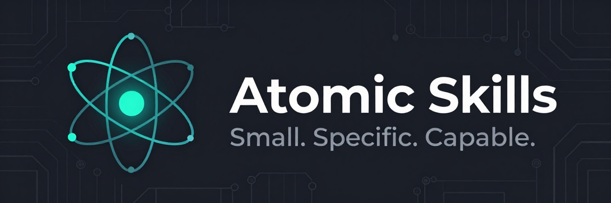

<p align="center">
  
</p>

Prompts otimizados que você instala uma vez e invoca em qualquer AI IDE. Cada skill é um átomo — pequeno o suficiente para manter o foco, específico o suficiente para não deixar ambiguidade, capaz o suficiente para fazer o agente realmente executar.

*Pare de reescrever prompts.*

> **[English version](README.md)**

```bash
npx @henryavila/atomic-skills install
```

## Por que Atomic?

Agentes de IA pulam etapas, racionalizam atalhos e ignoram instruções vagas. Atomic Skills resolve isso com técnicas battle-tested embutidas em cada prompt:

- **Small** — uma skill, um trabalho. Sem bloat, sem dependências entre skills
- **Specific** — cada etapa nomeia a ferramenta, exige evidência, define o que é "pronto"
- **Capable** — Iron Laws, HARD-GATEs, Red Flags, Tabelas de Racionalização. Técnicas que transformam "o agente deveria fazer X" em "o agente vai fazer X"

## Otimização Multi-Agente

Atomic Skills usa um **Polyglot Rendering Engine** que detecta seu agente e otimiza nomes de ferramentas e instruções automaticamente.

- **Claude Code**: Suporte nativo para `Bash`, `Read tool`, `Edit tool` e `Agent`.
- **Gemini CLI**: Suporte nativo para `run_shell_command`, `read_file`, `replace` e `codebase_investigator`.
- **Genérico/Outros**: Nomenclatura padronizada para máxima compatibilidade.

### IDEs Suportadas

| IDE | Perfil | Diretório | Formato |
|-----|--------|-----------|---------|
| **Claude Code** | `claude-code` | `.claude/skills/` | Markdown |
| **Gemini CLI** | `gemini` | `.gemini/skills/` | Markdown (Recomendado) |
| **Gemini CLI** | `gemini-commands`| `.gemini/commands/` | TOML (Slash commands) |
| Cursor | `cursor` | `.cursor/skills/` | Markdown |
| Codex | `codex` | `.agents/skills/` | Markdown |
| OpenCode | `opencode` | `.opencode/skills/` | Markdown |
| GitHub Copilot | `github-copilot`| `.github/skills/` | Markdown |

---

## Skills

### `atomic-skills:fix` — Diagnóstico e Correção de Bugs com TDD

**Problema que resolve:** Agentes pulam direto para a correção sem investigar a causa raiz, gerando regressões e fixes frágeis que quebram em outros cenários.

**O que faz:** Força um processo de 4 fases estilo detetive — observar evidências, diagnosticar com hipóteses testáveis, corrigir com TDD (teste primeiro, fix depois), e verificar com a suite completa.

**Quando usar:** Sempre que encontrar um bug ou comportamento inesperado no código.

**Vantagens:**
- Elimina fixes "no chute" — toda correção tem causa raiz documentada com número de linha
- Cluster de testes cobre regressão, partições de equivalência, limites e inputs de erro
- Mental mutation spot-checks verificam se cada condição do fix tem cobertura ("se eu trocasse `>=` por `>`, algum teste quebraria?")
- Limite de 5 hipóteses antes de escalar para o humano — evita loops infinitos

**Iron Law:** `NO FIX WITHOUT ROOT CAUSE`

---

### `atomic-skills:hunt` — Testes Adversariais para Código Existente

**Problema que resolve:** Código sem testes ou com cobertura incompleta esconde bugs silenciosos. Testes escritos "para confirmar" o código (em vez de quebrá-lo) são tautológicos e não pegam nada.

**O que faz:** Escreve testes agressivos e adversariais projetados para *quebrar* o código, não para confirmá-lo. Para arquivos individuais: processo de 6 fases (ler, entender intenção, mapear gaps, planejar ataque, escrever, reportar). Para diretórios: tria por risco e dispara subagentes isolados por arquivo.

**Quando usar:** Quando código não tem testes, quando a cobertura é baixa, ou quando você suspeita de edge cases não testados.

**Vantagens:**
- HARD-GATE contra tautologia: "O valor esperado veio da SPEC ou do CODE?" — se veio do código, o teste é inútil
- Ranking de risco para diretórios (0 refs de teste OU >8 commits = alto risco)
- Subagentes autônomos por arquivo impedem contaminação cruzada de contexto
- Bugs encontrados geram report estruturado com teste reprodutor pronto para o `as-fix`

**Iron Law:** `NO HUNT WITHOUT BOUNDED SCOPE`

---

### `atomic-skills:prompt` — Geração de Prompts Otimizados

**Problema que resolve:** Prompts genéricos falham porque não têm paths exatos, contexto real do codebase nem guardrails contra atalhos do agente.

**O que faz:** Explora o codebase primeiro (Glob, Grep, Read), identifica arquivos relevantes e dependências, e gera um prompt self-contained com Iron Law, etapas nomeando ferramentas, Red Flags e Tabela de Racionalização — tudo específico para a tarefa.

**Quando usar:** Quando você precisa de um prompt preciso com caminhos exatos e guardrails, seja para executar você mesmo ou delegar a um subagente.

**Vantagens:**
- Prompt gerado tem paths absolutos verificados (não "achismos")
- Cada etapa nomeia a ferramenta e exige evidência (número de linha)
- Oferece 3 opções: copiar, executar via subagente, ou ajustar
- Compatível com qualquer IDE via template variables

**Iron Law:** `NO PROMPT WITHOUT CODEBASE ANALYSIS`

---

### `atomic-skills:review-plan-internal` — Revisão Adversarial de Planos

**Problema que resolve:** Planos têm contradições internas, dependências quebradas, tarefas ambíguas e etapas faltando — problemas que só aparecem na implementação, quando o custo de correção é alto.

**O que faz:** Aplica um checklist de 7 itens contra o plano (contradições, dependências quebradas, ordenação, ambiguidade, schema, existência de arquivos, cobertura de testes), cita números de linha como prova, e itera até 3 vezes para verificar que as correções não introduziram novos problemas.

**Quando usar:** Antes de executar qualquer plano de implementação — validação de consistência interna.

**Vantagens:**
- Verifica existência de arquivos e comandos com Glob/Grep (não confia no plano)
- Classificação por severidade: Crítico (bloqueia), Significativo (causa retrabalho), Menor
- Loop de verificação impede que correções introduzam novos erros
- Cada finding cita linha exata do plano

**Iron Law:** `NO APPROVAL WITHOUT EVIDENCE`

---

### `atomic-skills:review-plan-vs-artifacts` — Plano vs. Artefatos

**Problema que resolve:** Planos simplificam demais os requisitos, perdem detalhes dos critérios de aceitação, ou adicionam coisas que ninguém pediu. A distância entre PRD/spec e plano cresce silenciosamente.

**O que faz:** Cruza o plano contra artefatos-fonte (PRD, specs, designs) com um checklist de 6 itens (cobertura de requisitos, critérios de aceitação, phase gates, dependências, schema/API, UX). Exige números de linha de AMBOS os documentos como prova.

**Quando usar:** Depois de gerar um plano a partir de specs/PRD — validação de cobertura cruzada.

**Vantagens:**
- HARD-GATE: corrige o PLANO, nunca o artefato-fonte (se o artefato tem erro, pergunta ao usuário)
- Prova de cobertura com linha do plano + linha do artefato
- Detecta requisitos faltando, critérios de aceitação oversimplificados, e features fantasma
- Loop de verificação (até 3x) garante que fixes não quebraram outras referências

**Iron Law:** `NO APPROVAL WITHOUT CROSS-REFERENCE`

---

### `atomic-skills:save-and-push` — Salvar Trabalho e Publicar

**Problema que resolve:** Trabalho fica espalhado na conversa, memória não é preservada para sessões futuras, commits são caóticos, e secrets são acidentalmente commitados.

**O que faz:** Revisa a conversa para extrair learnings (salva na memória), salva work-in-progress como arquivos, agrupa commits por unidade lógica (feature, camada, natureza), formata código se configurado, e faz push — com HARD-GATE em main/master.

**Quando usar:** No final de uma sessão de trabalho, ou quando quiser salvar progresso e publicar.

**Vantagens:**
- Memória persistente: padrões e decisões sobrevivem entre sessões
- Commits agrupados logicamente (não um dump de tudo junto)
- Filtragem de secrets (.env, credentials) com STOP obrigatório
- HARD-GATE impede push direto em main/master — exige branch + PR

**Iron Law:** `NO PUSH WITHOUT FRESH VERIFICATION`

---

### `atomic-skills:init-memory` — Inicialização de Memória Persistente

**Problema que resolve:** Projetos têm memória espalhada em locais diferentes (`.memory/`, `.claude/memory/`, `docs/memory/`, etc.), causando duplicação, perda de contexto e inconsistência.

**O que faz:** Detecta memória existente em todos os locais conhecidos, migra para o path canônico (`.ai/memory/`), organiza por temas, configura integração com Claude Code (`autoMemoryDirectory`), e limpa diretórios originais (com confirmação).

**Quando usar:** Ao iniciar um projeto novo ou ao padronizar a estrutura de memória de um projeto existente.

**Vantagens:**
- Um único local canônico, versionado no git e compartilhado com o time
- Respeita o limite de 200 linhas do MEMORY.md (conteúdo além é silenciosamente truncado pelo Claude)
- Migração segura: copia primeiro, valida, só remove original com confirmação
- Suporte a `autoMemoryDirectory` para integração direta (sem redirect)

**Iron Law:** `NO DELETION WITHOUT CONFIRMED BACKUP`

---

## Técnicas

Cada skill usa uma combinação destas técnicas para prevenir atalhos do agente:

| Técnica | O que faz | Exemplo |
|---------|-----------|---------|
| **Iron Law** | Uma regra inegociável no topo | `NO FIX WITHOUT ROOT CAUSE` |
| **HARD-GATE** | Parada obrigatória antes de ação perigosa | "Se modificar código sem teste: PARE" |
| **Red Flags** | Pensamentos que indicam que você está pulando etapas | "Eu já sei qual é o bug" |
| **Tabela de Racionalização** | Mapeia atalhos tentadores para por que eles falham | "O fix é óbvio" → "Óbvio pra quem? Prove" |
| **Exigência de Evidência** | Toda afirmação deve citar linha ou saída de ferramenta | "Cite arquivo:linha, não 'eu verifiquei'" |
| **Limite de Escalação** | Máximo de tentativas antes de perguntar ao humano | "5 hipóteses falharam → escalar" |
| **Test List** | Enumerar superfície de teste antes de escrever qualquer teste | Regressão + partições + limites + erros |
| **Mental Mutation** | Para cada condição: "um teste pegaria o inverso?" | "Se eu trocasse >= por >, um teste pegaria?" |
| **Modo Autônomo** | Regras para subagentes sem interação com usuário | "Auto-split >300 linhas, continuar em bugs" |

## Módulos

### Memory

Contexto persistente entre sessões. O agente salva learnings, decisões e feedback que sobrevivem entre conversas.

- Path configurável (padrão: `.ai/memory/`)
- Adiciona a skill `atomic-skills:init-memory`
- Suporte ao `autoMemoryDirectory` do Claude Code para integração direta
- Disponível em instalações project e user scope

## Desenvolvimento & Qualidade

Para garantir compatibilidade cross-agent, Atomic Skills inclui uma suite de testes que funciona como linter para templates de prompts.

```bash
npm test
```

A suite verifica:
1. **Abstração de Nomes de Ferramentas**: Garante que nenhum nome hardcoded (como `Bash` ou `Read tool`) existe nos `.md` fonte
2. **Renderização Condicional**: Valida que instruções agent-specific são corretamente incluídas/excluídas
3. **Exportação Multi-Formato**: Verifica geração de Markdown e TOML para todos os perfis

Ao criar novas skills, sempre use as variáveis definidas em `AGENTS.md`.

## Instalar, Atualizar, Desinstalar

```bash
npx @henryavila/atomic-skills install       # Primeira instalação ou atualização
npx @henryavila/atomic-skills uninstall     # Remover tudo
```

## Idiomas

- [English](README.md)
- Português (BR) ← você está aqui

## Licença

MIT
