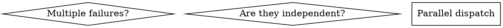

# Análise de Skills — superpowers v5.0.5

> Referência completa de técnicas, padrões e abordagens extraídos do plugin superpowers.
> Cada técnica inclui **origem** (arquivo-fonte) para rastreabilidade em futuras atualizações.

**Data da análise:** 2026-03-21
**Versão analisada:** superpowers 5.0.5
**Localização no cache:** `~/.claude/plugins/cache/claude-plugins-official/superpowers/5.0.5/skills/`
**Total:** 14 skills, 36 arquivos markdown

---

## 1. Arquitetura do Pacote

### Pipeline de desenvolvimento

```
brainstorming → writing-plans → [using-git-worktrees]
    → subagent-driven-development / executing-plans
    → requesting-code-review → finishing-a-development-branch
```

Skills transversais (qualquer ponto do pipeline):
- `systematic-debugging`, `test-driven-development`, `verification-before-completion`
- `dispatching-parallel-agents`, `receiving-code-review`
- `using-superpowers` (meta — roteador de skills)
- `writing-skills` (meta — como criar skills)

### Taxonomia funcional

| Tipo | Skills | Função |
|------|--------|--------|
| **Orquestradoras** | `using-superpowers`, `brainstorming`, `writing-plans`, `executing-plans`, `subagent-driven-development` | Controlam fluxo, invocam outras skills |
| **Disciplinadoras** | `test-driven-development`, `verification-before-completion`, `systematic-debugging` | Impõem regras absolutas, resistem racionalização |
| **Operacionais** | `using-git-worktrees`, `dispatching-parallel-agents`, `finishing-a-development-branch` | Executam tarefas específicas com checklist |
| **Sociais** | `requesting-code-review`, `receiving-code-review` | Gerenciam interação humano↔agente e agente↔agente |
| **Meta** | `writing-skills` | Ensina a criar novas skills (TDD para documentação) |

---

## 2. Catálogo de Técnicas

### T01 — Iron Laws (Regras Invioláveis)

**Origem:** `test-driven-development/SKILL.md`, `systematic-debugging/SKILL.md`, `verification-before-completion/SKILL.md`

Declaração absoluta no início da skill que não admite exceção:
```markdown
## The Iron Law
NO PRODUCTION CODE WITHOUT A FAILING TEST FIRST
```

**Quando usar:** Skills disciplinadoras que precisam resistir a pressão.
**Mecanismo:** Authority (Cialdini) — linguagem imperativa elimina decisão.

---

### T02 — HARD-GATE

**Origem:** `brainstorming/SKILL.md`

Tag XML explícita bloqueando ação prematura:
```markdown
<HARD-GATE>
Do NOT invoke any implementation skill until you have presented
a design and the user has approved it.
</HARD-GATE>
```

**Quando usar:** Quando existe uma tentação forte de pular etapas (ex: ir direto para código).
**Diferença do Iron Law:** Iron Law é regra geral; HARD-GATE é bloqueio pontual.

---

### T03 — Tabelas de Racionalização

**Origem:** `test-driven-development/SKILL.md`, `systematic-debugging/SKILL.md`, `verification-before-completion/SKILL.md`, `writing-skills/testing-skills-with-subagents.md`

Antecipa desculpas que o LLM vai inventar:
```markdown
| Excuse | Reality |
|--------|---------|
| "Too simple to test" | Simple code breaks. Test takes 30 seconds. |
| "I'll test after" | Tests passing immediately prove nothing. |
```

**Quando usar:** Qualquer skill disciplinadora.
**Como construir:** Via baseline testing (RED phase) — capturar racionalizações reais verbatim.
**Base científica:** Meincke et al. (2025), N=28.000 — compliance 33% → 72% com técnicas de persuasão.

---

### T04 — Red Flags (Auto-detecção de Violação)

**Origem:** `test-driven-development/SKILL.md`, `systematic-debugging/SKILL.md`, `verification-before-completion/SKILL.md`, `using-superpowers/SKILL.md`

Lista de pensamentos que o agente deve reconhecer como sinal de que está prestes a violar a regra:
```markdown
## Red Flags - STOP and Start Over
- Code before test
- "I already manually tested it"
- "Tests after achieve the same purpose"
- "This is different because..."
**All of these mean: Delete code. Start over with TDD.**
```

**Quando usar:** Complemento das tabelas de racionalização — formato mais conciso para self-check rápido.

---

### T05 — Princípio "Letra = Espírito"

**Origem:** `test-driven-development/SKILL.md`, `verification-before-completion/SKILL.md`, `writing-skills/SKILL.md`

Frase fundacional que corta toda uma classe de racionalização:
```markdown
**Violating the letter of the rules is violating the spirit of the rules.**
```

**Quando usar:** Posicionar cedo na skill (antes das regras). Impede o argumento "estou seguindo o espírito".
**Descoberto via:** Teste de pressão onde agente escolheu opção errada justificando "spirit not letter" (documentado em `testing-skills-with-subagents.md`).

---

### T06 — Flowcharts Graphviz Inline

**Origem:** `writing-skills/SKILL.md`, usado em praticamente todas as skills

Diagramas `dot` para decisões não-óbvias:


**Regras de uso (de writing-skills):**
- **SIM:** Decisões onde o agente pode errar, loops, "A vs B"
- **NÃO:** Referência, código, instruções lineares, labels genéricos

---

### T07 — Prompt Templates para Subagentes

**Origem:** `subagent-driven-development/implementer-prompt.md`, `spec-reviewer-prompt.md`, `code-quality-reviewer-prompt.md`, `requesting-code-review/code-reviewer.md`, `brainstorming/spec-document-reviewer-prompt.md`, `writing-plans/plan-document-reviewer-prompt.md`

Contexto fabricado sob medida, nunca herdado da sessão:
- **Implementer:** tarefa completa + contexto + permissão para perguntar + self-review + status codes
- **Spec Reviewer:** adversarial ("finished suspiciously quickly" — desconfia do implementer)
- **Code Reviewer:** template com placeholders `{BASE_SHA}`, `{HEAD_SHA}`, `{PLAN_OR_REQUIREMENTS}`

**Princípio central:** "They should never inherit your session's context or history — you construct exactly what they need."

**Status codes do implementer:** DONE | DONE_WITH_CONCERNS | BLOCKED | NEEDS_CONTEXT

---

### T08 — CSO (Claude Search Optimization)

**Origem:** `writing-skills/SKILL.md`

Description do frontmatter otimizada para **descoberta**, não para resumo:
```yaml
# BAD — Claude segue a description em vez de ler a skill
description: dispatches subagent per task with code review between tasks

# GOOD — Só condição de trigger
description: Use when executing implementation plans with independent tasks
```

**Regra crítica:** Descriptions que resumem workflow criam atalho que o Claude segue, ignorando o conteúdo real da skill.
**Descoberto via:** Bug real onde description com "code review between tasks" fez Claude fazer 1 review em vez de 2 (spec + quality).

**Elementos de CSO:**
- Começar com "Use when..."
- Keywords de sintomas e erros
- Sinônimos (timeout/hang/freeze)
- Nomes de ferramentas reais
- Terceira pessoa
- Nunca resumir workflow

---

### T09 — Commitment via Anúncio

**Origem:** `executing-plans/SKILL.md`, `using-git-worktrees/SKILL.md`, `brainstorming/SKILL.md`, `using-superpowers/SKILL.md`

Forçar o agente a se comprometer publicamente:
```markdown
**Announce at start:** "I'm using the executing-plans skill to implement this plan."
```

**Mecanismo:** Commitment (Cialdini) — declaração pública aumenta consistência.
**Reforço em using-superpowers:** TodoWrite obrigatório para checklists.

---

### T10 — Two-Stage Review

**Origem:** `subagent-driven-development/SKILL.md`

Dois reviews separados, em ordem:
1. **Spec Compliance** — fez o que pediu? (nada a mais, nada a menos)
2. **Code Quality** — fez bem? (clean, tested, maintainable)

**Regra:** Nunca iniciar quality review antes de spec compliance passar.
**Razão:** Polir código que não atende à spec é desperdício.

---

### T11 — Review Loops com Teto

**Origem:** `brainstorming/SKILL.md`, `writing-plans/SKILL.md`, `subagent-driven-development/SKILL.md`

```
Reviewer found issues → Implementer fixes → Re-review → Repeat
Max 3 iterations → Escalate to human
```

**Quando usar:** Qualquer loop de review automatizado.
**Razão do teto:** Loops infinitos desperdiçam tokens; 3+ iterações sugerem problema estrutural.

---

### T12 — Seleção de Modelo por Complexidade

**Origem:** `subagent-driven-development/SKILL.md`

```
- Mechanical tasks (1-2 files, clear spec) → cheap model (haiku)
- Integration tasks (multi-file) → standard model (sonnet)
- Architecture/review → most capable model (opus)
```

**Quando usar:** Ao despachar subagentes — economiza custo e aumenta velocidade.

---

### T13 — TDD para Documentação (Meta-técnica)

**Origem:** `writing-skills/SKILL.md`, `writing-skills/testing-skills-with-subagents.md`

Adapta RED-GREEN-REFACTOR para criação de skills:
1. **RED:** Rodar cenário de pressão SEM a skill → capturar racionalizações verbatim
2. **GREEN:** Escrever skill mínima que endereça as falhas observadas
3. **REFACTOR:** Encontrar novas racionalizações → adicionar counters → re-testar

**Cenários de pressão:** Combinam 3+ fatores (tempo + sunk cost + cansaço + autoridade).
**Meta-testing:** Perguntar ao agente "como a skill deveria ter sido escrita para você ter escolhido certo?"

---

### T14 — Defense-in-Depth

**Origem:** `systematic-debugging/defense-in-depth.md`

4 camadas de validação após encontrar root cause:
1. **Entry Point** — rejeitar input inválido na fronteira
2. **Business Logic** — validar no domínio
3. **Environment Guard** — impedir operações perigosas por contexto (ex: NODE_ENV=test)
4. **Debug Instrumentation** — logging para forense

**Princípio:** "Single validation: we fixed the bug. Multiple layers: we made the bug impossible."

---

### T15 — Root Cause Tracing

**Origem:** `systematic-debugging/root-cause-tracing.md`

Rastrear bug para trás na call chain até encontrar a origem:
1. Observar sintoma
2. Encontrar causa imediata
3. Perguntar "o que chamou isto?"
4. Continuar subindo
5. Fixar na origem, não no sintoma

**Complemento:** Adicionar stack traces com `new Error().stack` + `console.error()` em testes.

---

### T16 — Condition-Based Waiting

**Origem:** `systematic-debugging/condition-based-waiting.md`

Substituir `setTimeout`/`sleep` por polling de condição real:
```typescript
await waitFor(() => getResult() !== undefined);
```

**Regra:** Timeout arbitrário só quando testando timing behavior real (debounce, throttle) — e deve ser documentado com WHY.

---

### T17 — Persuasion Principles para Design de Skills

**Origem:** `writing-skills/persuasion-principles.md`

| Princípio | Uso | Evitar |
|-----------|-----|--------|
| Authority | Regras absolutas em skills disciplinadoras | — |
| Commitment | Anúncios, TodoWrite, checklists | — |
| Scarcity | Urgência ("IMMEDIATELY", "before proceeding") | — |
| Social Proof | Normas ("Every time", "Always") | — |
| Unity | Colaboração ("we're colleagues") | — |
| Reciprocity | — | Quase sempre (manipulativo) |
| Liking | — | Sempre em disciplina (gera sycophancy) |

**Base:** Cialdini (2021) + Meincke et al. (2025)

---

### T18 — Anti-Padrões de Testing

**Origem:** `test-driven-development/testing-anti-patterns.md`

| Anti-Padrão | Fix |
|-------------|-----|
| Testar comportamento de mocks | Test real component ou unmock |
| Métodos test-only em prod | Mover para test utilities |
| Mock sem entender dependências | Entender antes, mock mínimo |
| Mocks incompletos | Espelhar API real completamente |
| Tests como afterthought | TDD — tests first |

**Gate functions:** Perguntas que o agente deve fazer antes de cada ação (mock, assert, add method).

---

### T19 — Progressive Disclosure em Skills

**Origem:** `writing-skills/anthropic-best-practices.md`

- **SKILL.md** = overview + links (< 500 linhas)
- **Arquivos auxiliares** = referência pesada, templates, scripts
- **Máximo 1 nível** de referência (SKILL.md → file.md, nunca A→B→C)
- Arquivos longos (100+ linhas) devem ter TOC no início

---

### T20 — Graus de Liberdade

**Origem:** `writing-skills/anthropic-best-practices.md`

| Grau | Quando | Formato |
|------|--------|---------|
| **Alto** | Múltiplas abordagens válidas | Texto instrucional |
| **Médio** | Padrão preferido com variação | Pseudocódigo com parâmetros |
| **Baixo** | Operação frágil, consistência crítica | Script exato, sem modificar |

**Analogia:** Ponte estreita com abismo (baixa liberdade) vs campo aberto (alta liberdade).

---

### T21 — Structured Options (Menu de Escolhas)

**Origem:** `finishing-a-development-branch/SKILL.md`

Apresentar exatamente N opções numeradas, sem explicação extra:
```
1. Merge back to main locally
2. Push and create a Pull Request
3. Keep the branch as-is
4. Discard this work
Which option?
```

**Quando usar:** Pontos de decisão com opções finitas. Evita perguntas abertas ("what should I do?").
**Complemento:** Opções destrutivas (discard) exigem confirmação tipada.

---

### T22 — SUBAGENT-STOP

**Origem:** `using-superpowers/SKILL.md`

Tag que impede subagentes de executar a skill de roteamento:
```markdown
<SUBAGENT-STOP>
If you were dispatched as a subagent to execute a specific task, skip this skill.
</SUBAGENT-STOP>
```

**Quando usar:** Skills que só fazem sentido na sessão principal (meta/roteamento).

---

### T23 — Visual Companion (Browser-based Brainstorming)

**Origem:** `brainstorming/visual-companion.md`

Servidor local que serve HTML para mockups visuais durante brainstorming:
- Decisão **por pergunta** (não por sessão): "would the user understand better by seeing it?"
- Content fragments (sem `<html>`) auto-wrapped pelo servidor
- Interações via `.events` (JSON lines)
- Consentimento explícito antes de ativar

---

## 3. Padrão Estrutural de SKILL.md

**Origem:** `writing-skills/SKILL.md`, `writing-skills/anthropic-best-practices.md`

```markdown
---
name: kebab-case-com-hifens
description: "Use when [triggers específicos, sem resumo de workflow]"
---

# Nome da Skill

## Overview
Core principle em 1-2 frases.

## When to Use
[Flowchart se decisão não-óbvia]
- Bullets com sintomas e use cases
- When NOT to use

## The Process / Core Pattern
[Checklists, steps, code]

## Common Mistakes
[Tabela: mistake → fix]

## Red Flags
[Lista de pensamentos que significam STOP]

## Rationalization Table (se disciplinadora)
[Tabela: excuse → reality]

## Integration
- **Called by:** [quais skills invocam esta]
- **Pairs with:** [skills complementares]
```

---

## 4. Anti-Padrões de Escrita de Skills

**Origem:** `writing-skills/SKILL.md`

| Anti-Padrão | Problema |
|-------------|----------|
| Narrativa ("In session 2025-10-03, we found...") | Muito específico, não reutilizável |
| Multi-language (example-js, example-py, example-go) | Qualidade medíocre, manutenção pesada |
| Código em flowcharts | Não copy-pastable |
| Labels genéricos (helper1, step3) | Sem significado semântico |
| Description que resume workflow | Claude segue description e ignora skill body |
| Referências com `@` (force-load) | Queima 200k+ de contexto |
| Referências aninhadas (A→B→C) | Claude faz leitura parcial |
| Skill sem teste | "Deploying untested skills = deploying untested code" |

---

## 5. Mapa de Integração entre Skills

```
using-superpowers (roteador)
    ├── brainstorming
    │   ├── spec-document-reviewer (subagent)
    │   └── → writing-plans
    │       ├── plan-document-reviewer (subagent)
    │       └── → subagent-driven-development (recomendado)
    │           ├── implementer (subagent)
    │           ├── spec-reviewer (subagent)
    │           ├── code-quality-reviewer (subagent)
    │           └── → finishing-a-development-branch
    │       └── → executing-plans (alternativa)
    │           └── → finishing-a-development-branch
    ├── systematic-debugging (a qualquer momento)
    │   ├── root-cause-tracing
    │   ├── defense-in-depth
    │   └── condition-based-waiting
    ├── test-driven-development (dentro de cada task)
    │   └── testing-anti-patterns
    ├── verification-before-completion (antes de qualquer claim)
    ├── dispatching-parallel-agents (tasks independentes)
    ├── receiving-code-review (ao receber feedback)
    └── using-git-worktrees (antes de implementar)
```

---

## 6. Bugs e Lições Aprendidas do superpowers

### Checklist > Prosa: Etapas obrigatórias DEVEM estar no checklist

**Descoberto em:** brainstorming/SKILL.md (v5.0.5, documentado nas release notes)

A spec review loop (dispatch `spec-document-reviewer`, iterar até aprovado, max 3) existia documentada na prosa da seção "After the Design", mas **faltava no checklist numerado e no diagrama dot**. Resultado: agentes pulavam a etapa sistematicamente.

**Correção aplicada pelo superpowers:** adicionou a etapa como item 7/9 no checklist e nó no grafo dot.

**Regra derivada:** Toda etapa obrigatória deve estar em:
1. Checklist numerado (fonte primária que o agente segue)
2. Diagrama de fluxo (reforço visual, se aplicável)
3. Prosa é complementar — nunca o único lugar de uma etapa obrigatória

**Impacto nos `hca-`/`as-` commands:** o `hca-review-plan-internal` já segue esta regra (checklist + loop explícito). Verificar se todos os commands têm suas etapas obrigatórias em formato de checklist, não apenas em parágrafos.

---

## 7. Notas para Rastreamento de Atualizações

Ao atualizar para nova versão do superpowers, verificar:

1. **Novas skills** — `ls skills/` e comparar com esta lista
2. **Mudanças em frontmatter** — descriptions podem ter mudado (afeta CSO)
3. **Novos arquivos auxiliares** — templates de subagente, guias de técnica
4. **Técnicas removidas** — marcar como deprecated neste doc
5. **Mudanças em persuasion-principles** — afeta design de skills disciplinadoras

**Comando para diff rápido:**
```bash
diff <(ls OLD_PATH/skills/) <(ls NEW_PATH/skills/)
diff -rq OLD_PATH/skills/ NEW_PATH/skills/ --exclude='*.js'
```
