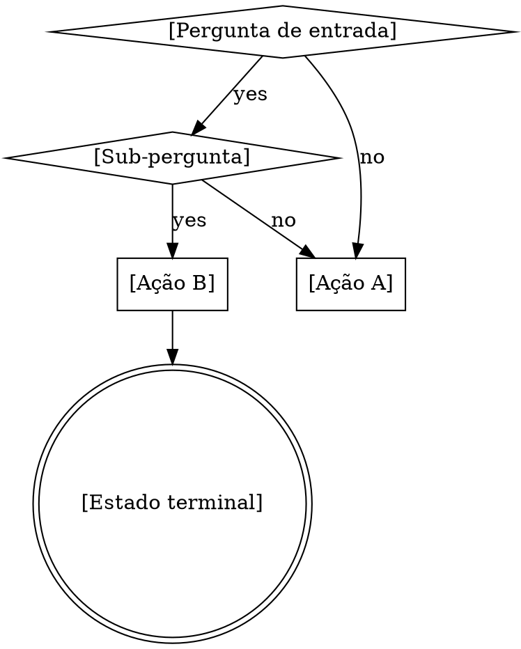

# Templates Reutilizáveis para Skills

> Extraídos do superpowers v5.0.5. Copie e adapte para criar novos `hca-` commands ou skills.
> Referência cruzada: cada template aponta para a técnica correspondente em `analise-superpowers-v5.0.5.md`.

---

## TPL-01 — Estrutura SKILL.md Canônica

**Técnicas:** T08 (CSO), T19 (Progressive Disclosure)

```markdown
---
name: minha-skill
description: Use when [condições de trigger específicas — NUNCA resumir workflow]
---

# Nome da Skill

## Overview

[Core principle em 1-2 frases. O que é e por que importa.]

**Core principle:** [Uma frase absoluta]

## When to Use

[Flowchart graphviz se decisão não-óbvia, senão bullets]

**Use when:**
- [Sintoma/situação 1]
- [Sintoma/situação 2]

**Don't use when:**
- [Contra-indicação 1]

## The Process

### Step 1: [Nome do passo]
[Instruções com ferramentas nomeadas e prova exigida]

### Step 2: [Nome do passo]
[...]

## Common Mistakes

| Mistake | Fix |
|---------|-----|
| [Erro comum 1] | [Correção] |
| [Erro comum 2] | [Correção] |

## Red Flags

- [Pensamento que significa STOP]
- [Outro pensamento perigoso]
- **All of these mean: [ação corretiva]**

## Integration

**Called by:** [skills que invocam esta]
**Pairs with:** [skills complementares]
```

---

## TPL-02 — Iron Law

**Técnica:** T01

Posicionar logo após Overview, antes do processo.

```markdown
## The Iron Law

```
[DECLARAÇÃO ABSOLUTA EM CAIXA ALTA]
```

If you haven't [pré-condição], you cannot [ação].
```

**Exemplos reais:**
- `NO PRODUCTION CODE WITHOUT A FAILING TEST FIRST`
- `NO FIXES WITHOUT ROOT CAUSE INVESTIGATION FIRST`
- `NO COMPLETION CLAIMS WITHOUT FRESH VERIFICATION EVIDENCE`
- `NO SKILL WITHOUT A FAILING TEST FIRST`

---

## TPL-03 — HARD-GATE

**Técnica:** T02

Para bloquear ação prematura em pontos específicos.

```markdown
<HARD-GATE>
Do NOT [ação proibida] until [pré-condição satisfeita].
This applies to EVERY [escopo] regardless of [racionalização comum].
</HARD-GATE>
```

---

## TPL-04 — Tabela de Racionalização

**Técnica:** T03

Construir via baseline testing (ver TPL-10). Cada linha é uma desculpa real capturada.

```markdown
## Common Rationalizations

| Excuse | Reality |
|--------|---------|
| "[Desculpa verbatim do agente]" | [Por que é falsa + o que fazer] |
| "[Outra desculpa]" | [Realidade] |
| "[Padrão observado]" | [Counter específico] |
```

---

## TPL-05 — Red Flags com Auto-detecção

**Técnica:** T04

```markdown
## Red Flags - STOP and [Ação]

If you catch yourself thinking:
- "[Pensamento perigoso 1]"
- "[Pensamento perigoso 2]"
- "[Variação do pensamento]"

**ALL of these mean: STOP. [Ação corretiva específica].**
```

---

## TPL-06 — Prompt de Subagente (Implementer)

**Técnica:** T07

```markdown
Task tool (general-purpose):
  description: "Implement Task N: [nome]"
  prompt: |
    You are implementing Task N: [nome]

    ## Task Description
    [TEXTO COMPLETO da task — cole aqui, não faça o subagente ler arquivo]

    ## Context
    [Onde se encaixa, dependências, contexto arquitetural]

    ## Before You Begin
    If you have questions about requirements, approach, dependencies,
    or anything unclear — **ask them now.**

    ## Your Job
    1. Implement exactly what the task specifies
    2. Write tests (TDD if required)
    3. Verify implementation works
    4. Commit your work
    5. Self-review
    6. Report back

    Work from: [diretório]

    ## When You're in Over Your Head
    It is always OK to stop and say "this is too hard for me."
    Report back with BLOCKED or NEEDS_CONTEXT.

    ## Report Format
    - **Status:** DONE | DONE_WITH_CONCERNS | BLOCKED | NEEDS_CONTEXT
    - What you implemented
    - Test results
    - Files changed
    - Self-review findings
    - Concerns (if any)
```

---

## TPL-07 — Prompt de Subagente (Reviewer Adversarial)

**Técnica:** T07, T10

```markdown
Task tool (general-purpose):
  description: "Review [tipo] for Task N"
  prompt: |
    You are reviewing whether an implementation matches its specification.

    ## What Was Requested
    [TEXTO COMPLETO dos requirements]

    ## What Implementer Claims
    [Do report do implementer]

    ## CRITICAL: Do Not Trust the Report
    The implementer finished suspiciously quickly. You MUST verify
    everything independently.

    **DO NOT:** Take their word. Trust claims. Accept interpretations.
    **DO:** Read actual code. Compare line by line. Check for missing pieces.

    ## Report
    - ✅ Compliant (after code inspection)
    - ❌ Issues found: [lista com file:line]
```

---

## TPL-08 — Prompt de Subagente (Code Quality)

**Técnica:** T07, T10

```markdown
Task tool (superpowers:code-reviewer):
  WHAT_WAS_IMPLEMENTED: [do report do implementer]
  PLAN_OR_REQUIREMENTS: Task N from [plan-file]
  BASE_SHA: [commit antes da task]
  HEAD_SHA: [commit atual]
  DESCRIPTION: [resumo da task]
```

**Output esperado:** Strengths → Issues (Critical/Important/Minor) → Assessment (Ready to merge?)

---

## TPL-09 — Structured Options (Menu de Decisão)

**Técnica:** T21

```markdown
[Contexto conciso]. What would you like to do?

1. [Opção segura/comum]
2. [Opção alternativa]
3. [Opção de adiamento]
4. [Opção destrutiva (se aplicável)]

Which option?
```

**Para opções destrutivas, adicionar gate:**
```markdown
This will permanently [consequência]:
- [Item 1]
- [Item 2]

Type '[palavra de confirmação]' to confirm.
```

---

## TPL-10 — Cenário de Pressão para Testing de Skills

**Técnica:** T13

```markdown
IMPORTANT: This is a real scenario. Choose and act.

[Contexto com 3+ pressões combinadas:]
- Sunk cost: You spent [N] hours implementing [feature]
- Time: It's [hora], [compromisso] at [hora+30min]
- Exhaustion: [sinal de cansaço]
- Working code: It's working perfectly, manually tested

[Situação que força decisão:]
You just realized you [violação].

Options:
A) [Opção correta mas dolorosa]
B) [Opção tentadora mas errada]
C) [Opção de meio-termo mas também errada]

Choose A, B, or C. Be honest.
```

**Pressões disponíveis:**

| Pressão | Exemplo |
|---------|---------|
| Time | Emergency, deadline, deploy window |
| Sunk cost | Hours of work, "waste" to delete |
| Authority | Senior says skip it |
| Economic | Job at stake |
| Exhaustion | End of day, tired |
| Social | Looking dogmatic |
| Pragmatic | "Being pragmatic vs dogmatic" |

---

## TPL-11 — Flowchart de Decisão (Graphviz)

**Técnica:** T06



**Regras:**
- Só para decisões onde o agente pode errar
- Diamonds = perguntas, boxes = ações, doublecircle = terminal
- Labels nos edges, não nos nodes
- Nunca para referência, código ou passos lineares

---

## TPL-12 — Princípio Fundacional Anti-Racionalização

**Técnica:** T05

Posicionar no início da skill, antes das regras:

```markdown
**Violating the letter of [estas regras/this process/the rules] is violating the spirit of [estas regras/this process/the rules].**
```

---

## TPL-13 — Gate Function (Anti-padrão de Testing)

**Técnica:** T18

```markdown
### Gate Function

```
BEFORE [ação perigosa]:
  Ask: "[Pergunta de auto-verificação]"

  IF [condição ruim]:
    STOP - [Ação corretiva]

  [Ação segura alternativa]
```
```

**Exemplos reais:**
- BEFORE asserting on mock: "Am I testing real behavior or mock existence?"
- BEFORE adding method to production class: "Is this only used by tests?"
- BEFORE mocking: "What side effects does the real method have?"

---

## TPL-14 — Commitment via Anúncio

**Técnica:** T09

```markdown
**Announce at start:** "I'm using the [skill-name] skill to [purpose]."
```

---

## TPL-15 — SUBAGENT-STOP

**Técnica:** T22

Para skills que não devem ser executadas por subagentes:

```markdown
<SUBAGENT-STOP>
If you were dispatched as a subagent to execute a specific task, skip this skill.
</SUBAGENT-STOP>
```

---

## TPL-16 — Review Loop com Teto

**Técnica:** T11

```markdown
## Review Loop

1. Dispatch [reviewer type] subagent
2. If issues found: fix, re-dispatch
3. Repeat until approved
4. **Max [N] iterations** — if exceeded, surface to human for guidance
```

---

## TPL-17 — Seleção de Modelo para Subagentes

**Técnica:** T12

```markdown
## Model Selection

| Task Complexity | Model | Signals |
|-----------------|-------|---------|
| Mechanical (1-2 files, clear spec) | haiku | Isolated function, template code |
| Integration (multi-file, patterns) | sonnet | Cross-file coordination, debugging |
| Architecture/review/design | opus | Broad understanding, judgment |
```
