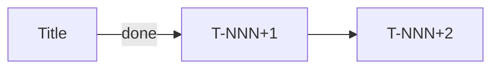

# `atomic-skills:project-status` Implementation Plan

> **For agentic workers:** REQUIRED SUB-SKILL: Use superpowers:subagent-driven-development (recommended) or superpowers:executing-plans to implement this plan task-by-task. Steps use checkbox (`- [ ]`) syntax for tracking.

**Goal:** Ship `atomic-skills:project-status` — a new core skill that maintains a canonical per-initiative status tree (`.atomic-skills/PROJECT-STATUS.md` + `.atomic-skills/initiatives/<slug>.md`) with three enforcement layers (skill + CLAUDE.md/AGENTS.md HARD-GATE + Claude Code hooks), terminal and browser rendering, and cross-repo scope that emerges from tool activity.

**Architecture:** The skill is a single Markdown prompt (`skills/pt/core/project-status.md` + EN translation) that instructs the invoking LLM on 13 invocation modes. Setup assets (templates for CLAUDE.md injection, AGENTS.md redirect, skeleton index, initiative template, hook scripts) live under `skills/shared/project-status-assets/`. Runtime state at the user's project lives under `.atomic-skills/`. Hooks use bash (zero-deps, portable). No new Node modules; the existing `src/yaml.js` parser is sufficient for YAML frontmatter handling.

**Tech Stack:** Markdown (skill body), YAML (frontmatter state), Bash (hook scripts), Mermaid (browser diagrams), `@henryavila/mdprobe` via `npx -y` (browser render). Test framework: `node:test` + `strict assert` (matches existing `tests/*.test.js`).

**Reference spec:** `/home/henry/atomic-skills/docs/superpowers/specs/2026-04-22-status-initiative-design.md` (v2 at commit `9653153`). Every task below cites the spec section it implements.

---

## Design Decisions

1. **Branch strategy:** dedicated feature branch `feat/project-status-skill`. Spec already on main (commits `17b32ff` + `9653153`). Feature branch for implementation; PR at the end.

2. **Skill file structure:** ONE `.md` per language (`pt/core/project-status.md` + `en/core/project-status.md`), not split by mode. Matches `parallel-dispatch.md` convention.

3. **Rendering is LLM-driven, not compiled:** the skill body instructs the LLM to format terminal output with specified icons/colors. No new Node code for rendering. Exception: YAML parsing uses existing `src/yaml.js` via Bash tool invocation.

4. **Templates live in `skills/shared/project-status-assets/`:** new directory, matches spec §15. Installer does not copy these automatically to user projects — the skill copies them during its own setup flow.

5. **Test count assertions update:** current tests hard-code `8` for core skill count. New skill brings total to `9`. Update 5+ assertions across `install.test.js` and `detect.test.js`.

6. **Hooks in bash, not Node:** zero dependency, universally available. Matches pattern noted in spec §18 deferred decisions.

7. **Browser render via `npx -y @henryavila/mdprobe`:** no install dependency on user project. Skill asks confirmation before launching browser (intrusive-actions rule).

## File Structure

| File | Action | Responsibility |
|------|--------|----------------|
| `skills/pt/core/project-status.md` | Create | Portuguese skill body — all 13 invocation modes, setup, rendering |
| `skills/en/core/project-status.md` | Create | English translation of skill body |
| `skills/shared/project-status-assets/CLAUDE.md-gate.template.md` | Create | HARD-GATE block template with markers |
| `skills/shared/project-status-assets/AGENTS.md.template.md` | Create | AGENTS.md redirect template |
| `skills/shared/project-status-assets/PROJECT-STATUS.md.template.md` | Create | Root index skeleton |
| `skills/shared/project-status-assets/initiative.template.md` | Create | Per-initiative skeleton with YAML + narrative stub |
| `skills/shared/project-status-assets/hooks/session-start.sh` | Create | Layer 2b hook script |
| `skills/shared/project-status-assets/hooks/stop.sh` | Create | Layer 3 hook script (dry-run default) |
| `skills/shared/project-status-assets/hooks/config.json` | Create | Hook config defaults |
| `skills/shared/project-status-assets/hooks/README.md` | Create | How to debug / disable / promote to strict |
| `meta/skills.yaml` | Modify | Register `core.project-status` entry |
| `tests/install.test.js` | Modify | Update `8`→`9` core-skill assertions |
| `tests/detect.test.js` | Modify | Update `'8 core'`→`'9 core'` assertions |
| `tests/project-status.test.js` | Create | Render + setup flow + hook invocation tests |
| `tests/hooks/session-start.test.sh` | Create | Bash-level unit tests for `session-start.sh` |
| `tests/hooks/stop.test.sh` | Create | Bash-level unit tests for `stop.sh` |
| `README.md` | Modify | Add `project-status` row in overview table + full section |
| `README.pt-BR.md` | Modify | Mirror Portuguese |
| `TODO.md` | Modify | Add follow-up: extract `install-project-instruction` helper |
| `CLAUDE.md` | Modify | Add 2-line reference to new skill |

**Unchanged (must still pass all existing tests):** `src/install.js`, `src/render.js`, `src/config.js`, `src/detect.js`, `src/yaml.js`, `src/manifest.js`, `src/hash.js`, `src/status.js`, `src/ui.js`, `bin/cli.js`, all other skill files, all other tests.

---

### Task 1: Create feature branch

**Files:** none (git state only)

- [ ] **Step 1: Verify main is clean and up to date**

```bash
cd /home/henry/atomic-skills
git status --porcelain
git log -1 --oneline
```

Expected: working tree clean; HEAD at `9653153 docs: revise atomic-skills:project-status spec v2 post-annotations`.

- [ ] **Step 2: Create and switch to feature branch**

```bash
git checkout -b feat/project-status-skill
git branch --show-current
```

Expected: `feat/project-status-skill`.

- [ ] **Step 3: Create assets directory**

```bash
mkdir -p skills/shared/project-status-assets/hooks
mkdir -p tests/hooks
ls -la skills/shared/
```

Expected: `skills/shared/project-status-assets/hooks/` exists, `tests/hooks/` exists.

---

### Task 2: Write CLAUDE.md-gate template

**Files:**
- Create: `skills/shared/project-status-assets/CLAUDE.md-gate.template.md`

Implements spec §10 CLAUDE.md HARD-GATE block.

- [ ] **Step 1: Write template file**

```markdown
<!-- atomic-skills:status-gate:start v=1.0.0 -->
## Status Tracking (atomic-skills:project-status)

<HARD-GATE>
BEFORE any Write/Edit operation in source code:

1. Read `.atomic-skills/PROJECT-STATUS.md`. Determine which initiative this work fits.
2. Resolution rules:
   - Exact match with an active initiative (by branch or scope_paths) → read `.atomic-skills/initiatives/<slug>.md` and report current stack frame
   - Multiple candidate initiatives, or new/ambiguous context → ASK the user:
     "Is this (a) continuation of <X>, (b) lateral expansion of <X>, (c) new initiative, or (d) ad-hoc work?"
   - No active initiative and context is new → ask: "Does this require a new initiative, or is it ad-hoc?"
3. Before the edit, announce which stack frame you are in.
4. If the edit opens a new depth (research, discussion, expansion), invoke
   `atomic-skills:project-status push <description>` BEFORE the edit.
5. If the edit closes a frame (done, parked, emerged), update via
   `atomic-skills:project-status pop` / `park` / `emerge` / `done` AFTER the edit in the same turn.

VIOLATION = code written without anchor = the exact problem this skill exists to prevent.
</HARD-GATE>

Invoke `atomic-skills:project-status` to view status at any time. Hooks will also auto-inject context at SessionStart.
<!-- atomic-skills:status-gate:end -->
```

Save to `skills/shared/project-status-assets/CLAUDE.md-gate.template.md`.

- [ ] **Step 2: Verify markers balance**

```bash
grep -c "atomic-skills:status-gate:start" skills/shared/project-status-assets/CLAUDE.md-gate.template.md
grep -c "atomic-skills:status-gate:end" skills/shared/project-status-assets/CLAUDE.md-gate.template.md
```

Expected: both `1`.

- [ ] **Step 3: Commit**

```bash
git add skills/shared/project-status-assets/CLAUDE.md-gate.template.md
git commit -m "feat(project-status): add CLAUDE.md HARD-GATE template"
```

---

### Task 3: Write AGENTS.md template

**Files:**
- Create: `skills/shared/project-status-assets/AGENTS.md.template.md`

Implements spec §10 AGENTS.md redirect.

- [ ] **Step 1: Write template file**

```markdown
# AI Agent Instructions

This project follows Claude Code conventions. Read and follow @CLAUDE.md for all instructions, including status tracking requirements.

Additional project context:
- Memory: `.ai/memory/MEMORY.md` (see `atomic-skills:init-memory`)
- Status: `.atomic-skills/PROJECT-STATUS.md` (see `atomic-skills:project-status`)
```

Save to `skills/shared/project-status-assets/AGENTS.md.template.md`.

- [ ] **Step 2: Commit**

```bash
git add skills/shared/project-status-assets/AGENTS.md.template.md
git commit -m "feat(project-status): add AGENTS.md redirect template"
```

---

### Task 4: Write PROJECT-STATUS.md skeleton template

**Files:**
- Create: `skills/shared/project-status-assets/PROJECT-STATUS.md.template.md`

Implements spec §7.2 PROJECT-STATUS.md.

- [ ] **Step 1: Write template file**

```markdown
---
last_updated: REPLACE_ISO_TIMESTAMP
active_count: 0
archived_count: 0
---

# Project Status Index

Canonical entry point. Auto-updated by `atomic-skills:project-status`. Read first every session.

## Active Initiatives

_(none yet — run `atomic-skills:project-status new <slug>` to start one)_

## Recently Archived (last 10)

_(empty)_

## Ad-Hoc Sessions Log (last 5)

_(empty)_
```

The literal string `REPLACE_ISO_TIMESTAMP` is a substitution marker the skill replaces on first copy.

- [ ] **Step 2: Commit**

```bash
git add skills/shared/project-status-assets/PROJECT-STATUS.md.template.md
git commit -m "feat(project-status): add PROJECT-STATUS.md skeleton"
```

---

### Task 5: Write initiative skeleton template

**Files:**
- Create: `skills/shared/project-status-assets/initiative.template.md`

Implements spec §7.1 initiative file format.

- [ ] **Step 1: Write template file**

```markdown
---
initiative_id: REPLACE_SLUG
status: active
started: REPLACE_DATE
last_updated: REPLACE_ISO_TIMESTAMP
branch: REPLACE_BRANCH_OR_EMPTY
worktree:
plan_link:
wip_limit: 2
scope_paths:
  - .

stack:
  - {id: 1, title: "REPLACE_INITIATIVE_TITLE", type: initiative, opened_at: REPLACE_ISO_TIMESTAMP}

tasks: {}

parked: []

emerged: []

next_action: "REPLACE_INITIAL_NEXT_ACTION"
---

# Narrative / notes

Free-form Markdown below. The skill does NOT mutate this region automatically.

## Decisions

_(record decisions here as they are made)_

## Links

_(plan doc, external refs, etc.)_
```

- [ ] **Step 2: Commit**

```bash
git add skills/shared/project-status-assets/initiative.template.md
git commit -m "feat(project-status): add initiative skeleton template"
```

---

### Task 6: Write SessionStart hook script

**Files:**
- Create: `skills/shared/project-status-assets/hooks/session-start.sh`

Implements spec §11 L2b SessionStart hook.

- [ ] **Step 1: Write the script**

```bash
#!/usr/bin/env bash
# atomic-skills:project-status — SessionStart hook
# Injects PROJECT-STATUS.md index + matching initiative detail via additionalContext.
set -euo pipefail

PROJ_DIR="${CLAUDE_PROJECT_DIR:-$PWD}"
STATUS_FILE="$PROJ_DIR/.atomic-skills/PROJECT-STATUS.md"
INITIATIVES_DIR="$PROJ_DIR/.atomic-skills/initiatives"

context=""

# 1. Inject project-level index (top 20 lines of PROJECT-STATUS.md)
if [[ -f "$STATUS_FILE" ]]; then
  context+="## Active Project Status"$'\n'
  context+="$(head -20 "$STATUS_FILE")"$'\n\n'
fi

# 2. Detect active initiative by branch match
branch=$(git -C "$PROJ_DIR" rev-parse --abbrev-ref HEAD 2>/dev/null || echo "")
match=""
if [[ -n "$branch" && -d "$INITIATIVES_DIR" ]]; then
  match=$(grep -l "^branch: $branch$" "$INITIATIVES_DIR"/*.md 2>/dev/null | head -1)
  if [[ -z "$match" ]]; then
    match=$(grep -l "^branch: ${branch%%/*}" "$INITIATIVES_DIR"/*.md 2>/dev/null | head -1)
  fi
fi

# 3. Inject initiative detail (top 40 lines) if matched
if [[ -n "$match" ]]; then
  slug=$(basename "$match" .md)
  context+="## Current Initiative: $slug"$'\n'
  context+="$(head -40 "$match")"$'\n'
fi

# 4. Emit as JSON with additionalContext
if command -v jq >/dev/null 2>&1; then
  jq -n --arg ctx "$context" \
    '{hookSpecificOutput: {hookEventName: "SessionStart", additionalContext: $ctx}}'
else
  # Fallback: manual JSON escape
  escaped=$(printf '%s' "$context" | python3 -c 'import json,sys; print(json.dumps(sys.stdin.read()))' 2>/dev/null \
    || printf '"%s"' "$(printf '%s' "$context" | sed 's/\\/\\\\/g; s/"/\\"/g' | tr '\n' ' ')")
  printf '{"hookSpecificOutput":{"hookEventName":"SessionStart","additionalContext":%s}}\n' "$escaped"
fi

exit 0
```

Save and make executable:

```bash
chmod +x skills/shared/project-status-assets/hooks/session-start.sh
```

- [ ] **Step 2: Smoke test with no `.atomic-skills/` (should emit empty context, exit 0)**

```bash
cd /tmp && mkdir -p as-hook-test && cd as-hook-test
bash /home/henry/atomic-skills/skills/shared/project-status-assets/hooks/session-start.sh
echo "exit=$?"
cd /home/henry/atomic-skills
```

Expected: JSON output with `additionalContext: ""`, `exit=0`.

- [ ] **Step 3: Commit**

```bash
git add skills/shared/project-status-assets/hooks/session-start.sh
git commit -m "feat(project-status): add SessionStart hook script"
```

---

### Task 7: Write Stop hook script + config

**Files:**
- Create: `skills/shared/project-status-assets/hooks/stop.sh`
- Create: `skills/shared/project-status-assets/hooks/config.json`

Implements spec §12 L3 Stop hook in dry-run default.

- [ ] **Step 1: Write the config file**

```json
{
  "strict_mode": false,
  "dry_run_started": "REPLACE_DATE",
  "source_globs": [
    "src/",
    "lib/",
    "app/",
    "services/",
    "pkg/",
    "internal/"
  ],
  "max_stack_depth_warning": 6,
  "auto_archive_done_threshold": 30
}
```

Save to `skills/shared/project-status-assets/hooks/config.json`.

- [ ] **Step 2: Write the Stop hook script**

```bash
#!/usr/bin/env bash
# atomic-skills:project-status — Stop hook
# Validates that code edits triggered a status file update. Dry-run logs; strict blocks via exit 2.
set -euo pipefail

PROJ_DIR="${CLAUDE_PROJECT_DIR:-$PWD}"
CONFIG="$PROJ_DIR/.atomic-skills/status/config.json"
LOG="$PROJ_DIR/.atomic-skills/status/stop.log"
SKIP_FLAG="$PROJ_DIR/.atomic-skills/status/SKIP"

# Emergency bypass (24h grace)
if [[ -f "$SKIP_FLAG" ]]; then
  skip_mtime=$(stat -c %Y "$SKIP_FLAG" 2>/dev/null || stat -f %m "$SKIP_FLAG" 2>/dev/null || echo 0)
  now=$(date +%s)
  [[ $((now - skip_mtime)) -lt 86400 ]] && exit 0
fi

# Parse stdin payload
payload=$(cat)
transcript_path=$(printf '%s' "$payload" | jq -r '.transcript_path // empty' 2>/dev/null || echo "")
stop_hook_active=$(printf '%s' "$payload" | jq -r '.stop_hook_active // false' 2>/dev/null || echo "false")

# Loop prevention (Anthropic-recommended)
[[ "$stop_hook_active" == "true" ]] && exit 0

# Config must exist
[[ ! -f "$CONFIG" ]] && exit 0

strict_mode=$(jq -r '.strict_mode // false' "$CONFIG")
mapfile -t source_globs < <(jq -r '.source_globs[]' "$CONFIG")

# Determine active initiative by branch
branch=$(git -C "$PROJ_DIR" rev-parse --abbrev-ref HEAD 2>/dev/null || echo "")
[[ -z "$branch" ]] && exit 0

active=""
if [[ -d "$PROJ_DIR/.atomic-skills/initiatives" ]]; then
  while IFS= read -r f; do
    grep -q "^status: active$" "$f" && grep -q "^branch: $branch$" "$f" && { active="$f"; break; }
  done < <(find "$PROJ_DIR/.atomic-skills/initiatives" -maxdepth 1 -name '*.md')
fi
[[ -z "$active" ]] && exit 0

# Check code edits since last user turn
[[ -z "$transcript_path" || ! -f "$transcript_path" ]] && exit 0

last_user_ts=$(tac "$transcript_path" 2>/dev/null | grep -m1 '"role":"user"' | jq -r '.timestamp // empty' 2>/dev/null || echo "")
[[ -z "$last_user_ts" ]] && exit 0

# Build regex from source_globs
glob_pattern=$(IFS='|'; echo "${source_globs[*]}")
code_edits=$(jq -r --arg ts "$last_user_ts" \
  'select(.timestamp > $ts and (.tool_use.name == "Write" or .tool_use.name == "Edit")) | .tool_use.input.file_path // empty' \
  "$transcript_path" 2>/dev/null | grep -E "$glob_pattern" || true)
[[ -z "$code_edits" ]] && exit 0

# Check initiative mtime vs turn start
initiative_mtime=$(stat -c %Y "$active" 2>/dev/null || stat -f %m "$active" 2>/dev/null || echo 0)
turn_start_ts=$(date -d "$last_user_ts" +%s 2>/dev/null || echo 0)

if [[ "$initiative_mtime" -lt "$turn_start_ts" ]]; then
  msg="Code edited without updating $(basename "$active"). Update stack/parking lot/tasks before ending turn."
  if [[ "$strict_mode" == "true" ]]; then
    echo "$msg" >&2
    exit 2
  else
    mkdir -p "$(dirname "$LOG")"
    echo "[$(date -Iseconds)] DRY-RUN would-block: $msg" >> "$LOG"
    exit 0
  fi
fi

exit 0
```

Save and make executable:

```bash
chmod +x skills/shared/project-status-assets/hooks/stop.sh
```

- [ ] **Step 3: Smoke test with no active initiative**

```bash
cd /tmp && mkdir -p as-stop-test && cd as-stop-test
echo '{"stop_hook_active":false,"transcript_path":"/nonexistent"}' | \
  bash /home/henry/atomic-skills/skills/shared/project-status-assets/hooks/stop.sh
echo "exit=$?"
cd /home/henry/atomic-skills
```

Expected: `exit=0`, no stderr.

- [ ] **Step 4: Commit**

```bash
git add skills/shared/project-status-assets/hooks/stop.sh skills/shared/project-status-assets/hooks/config.json
git commit -m "feat(project-status): add Stop hook (dry-run default) + config"
```

---

### Task 8: Write hooks README

**Files:**
- Create: `skills/shared/project-status-assets/hooks/README.md`

- [ ] **Step 1: Write operator documentation**

```markdown
# project-status hooks

## Files

- `session-start.sh` — L2b. Reads `.atomic-skills/PROJECT-STATUS.md` and matching initiative; emits via `additionalContext` at SessionStart.
- `stop.sh` — L3. On Stop event, if code was edited but initiative file unchanged, logs (dry-run) or blocks (strict).
- `config.json` — thresholds and mode flag.
- `stop.log` — dry-run decision log (gitignored).

## Debugging

### Check if hooks are registered (Claude Code)

```bash
cat .claude/settings.local.json | jq '.hooks'
```

Expected: entries for `SessionStart` and optionally `Stop` pointing to `.atomic-skills/status/hooks/*.sh`.

### Simulate a Stop hook call

```bash
echo '{"stop_hook_active":false,"transcript_path":"/path/to/transcript.jsonl"}' | \
  bash .atomic-skills/status/hooks/stop.sh
echo "exit=$?"
```

### Read the dry-run log

```bash
tail -50 .atomic-skills/status/stop.log
```

Each line is a timestamped decision the hook would have taken in strict mode.

## Disabling

### Temporary (24h)

```bash
touch .atomic-skills/status/SKIP
```

Auto-expires after 24h. Delete the file to re-enable sooner.

### Permanent

Remove the hook entry from `.claude/settings.local.json`, or run:

```bash
npx atomic-skills uninstall --project  # removes this skill's artifacts
```

## Promoting to strict mode

After reviewing `stop.log` and confirming dry-run decisions were correct:

```bash
jq '.strict_mode = true' .atomic-skills/status/config.json > /tmp/c.json && mv /tmp/c.json .atomic-skills/status/config.json
```

Or invoke `atomic-skills:project-status` — it offers strict-mode promotion if dry-run has been active 7+ days.
```

- [ ] **Step 2: Commit**

```bash
git add skills/shared/project-status-assets/hooks/README.md
git commit -m "docs(project-status): hooks operator README"
```

---

### Task 9: Update core skill count assertions

**Files:**
- Modify: `tests/install.test.js`
- Modify: `tests/detect.test.js`

Spec §15 — adding `project-status` raises core count from 8 to 9.

- [ ] **Step 1: Write tests first to verify current failure direction**

Run existing tests to confirm they pass with count=8 *before* adding the skill:

```bash
cd /home/henry/atomic-skills
npm test 2>&1 | head -40
```

Expected: all tests pass (we have not registered the new skill yet).

- [ ] **Step 2: Update install.test.js — change all `8` core-skill assertions to `9`**

Replace in `tests/install.test.js`:
- Line 38: `result.files.length, 8` → `result.files.length, 9`
- Line 83: `result.files.length, 9` (core+module) → `result.files.length, 10`
- Line 144: `result.files.length, 16` (8*2 IDEs) → `result.files.length, 18`
- Line 221: `result.files.length, 8` → `result.files.length, 9`

Use Edit tool with `replace_all: false` and unique context per occurrence.

- [ ] **Step 3: Update detect.test.js**

Replace in `tests/detect.test.js`:
- Line 97: `'8 core'` → `'9 core'`
- Line 102: `'8 core + 1 module'` → `'9 core + 1 module'`
- Line 107: `'8 core'` → `'9 core'`

- [ ] **Step 4: Run tests — should FAIL because skill not registered yet**

```bash
npm test 2>&1 | grep -E "(fail|pass|skill)" | head -20
```

Expected: failures indicating skill count mismatch or missing skill file.

- [ ] **Step 5: DO NOT COMMIT YET.** Tests stay red until Task 10 registers the skill. Proceed to Task 10.

---

### Task 10: Register skill in meta + create minimal skill stubs

**Files:**
- Modify: `meta/skills.yaml`
- Create: `skills/pt/core/project-status.md` (stub)
- Create: `skills/en/core/project-status.md` (stub)

- [ ] **Step 1: Add entry to meta/skills.yaml**

Add under `core:` (alphabetical after `prompt`, before `review-plan-internal`):

```yaml
  project-status:
    name: project-status
    description: "Canonical per-initiative status tracking. Maintains .atomic-skills/ tree with stack + tasks + parked + emerged per initiative. Terminal compact view + browser via mdprobe. Auto-installs CLAUDE.md HARD-GATE + AGENTS.md redirect + Claude Code hooks (SessionStart injection, Stop predicate in dry-run). Use whenever starting, resuming, pushing/popping stack frames, parking lateral findings, or viewing status across sessions and worktrees."
```

Use Edit tool to insert.

- [ ] **Step 2: Write minimal skill stub (PT)**

Create `skills/pt/core/project-status.md` with a minimum viable body so render tests pass. Content is intentionally stub-level — fleshed out in Task 11-15.

```markdown
Mantenha o estado canônico de iniciativas em `.atomic-skills/` — ler, criar, atualizar e exibir.

## Regra Fundamental

NO IMPLEMENTATION WITHOUT ANCHORED INITIATIVE.

Todo código modificado deve ser ancorado a uma iniciativa ativa em `.atomic-skills/initiatives/<slug>.md`, ou o usuário deve declarar explicitamente "ad-hoc".

## Detecção inicial

Rode com {{BASH_TOOL}}:
- `test -d .atomic-skills/` — se não existe, entre em modo setup
- Se existe, leia `.atomic-skills/PROJECT-STATUS.md` e determine iniciativa ativa

## Modos

Ver seções abaixo conforme os args recebidos em {{ARG_VAR}}.

(Implementação completa nas tasks 11-15 do plano.)
```

- [ ] **Step 3: Write minimal skill stub (EN)**

Create `skills/en/core/project-status.md`:

```markdown
Maintain canonical per-initiative status in `.atomic-skills/` — read, create, update, display.

## Iron Law

NO IMPLEMENTATION WITHOUT ANCHORED INITIATIVE.

Every code-modifying session must be anchored to an active initiative in `.atomic-skills/initiatives/<slug>.md`, or the user must explicitly declare "ad-hoc".

## Initial detection

Run with {{BASH_TOOL}}:
- `test -d .atomic-skills/` — if absent, enter setup mode
- If present, read `.atomic-skills/PROJECT-STATUS.md` and determine active initiative

## Modes

See sections below per {{ARG_VAR}}.

(Full implementation in plan tasks 11-15.)
```

- [ ] **Step 4: Run tests — assertions should now pass**

```bash
npm test 2>&1 | tail -20
```

Expected: all tests pass with new count=9.

- [ ] **Step 5: Commit**

```bash
git add meta/skills.yaml skills/pt/core/project-status.md skills/en/core/project-status.md tests/install.test.js tests/detect.test.js
git commit -m "feat(project-status): register skill + stub + update test counts to 9"
```

---

### Task 11: Skill body — setup flow section

**Files:**
- Modify: `skills/pt/core/project-status.md`
- Modify: `skills/en/core/project-status.md`

Implements spec §6 Setup flow.

- [ ] **Step 1: Write test first for setup idempotency**

Create `tests/project-status.test.js` skeleton (will be filled across tasks):

```js
import { describe, it, beforeEach, afterEach } from 'node:test';
import { strict as assert } from 'node:assert';
import { mkdtempSync, rmSync, readFileSync, writeFileSync, mkdirSync, existsSync } from 'node:fs';
import { join } from 'node:path';
import { tmpdir } from 'node:os';
import { fileURLToPath } from 'node:url';
import { installSkills } from '../src/install.js';

const __dirname = fileURLToPath(new URL('.', import.meta.url));
const SKILLS_DIR = join(__dirname, '..', 'skills');
const META_DIR = join(__dirname, '..', 'meta');

describe('project-status skill', () => {
  let tempDir;

  beforeEach(() => {
    tempDir = mkdtempSync(join(tmpdir(), 'as-ps-'));
  });

  afterEach(() => {
    rmSync(tempDir, { recursive: true, force: true });
  });

  it('renders skill file for claude-code without template leaks', () => {
    installSkills(tempDir, {
      language: 'en',
      ides: ['claude-code'],
      modules: {},
      skillsDir: SKILLS_DIR,
      metaDir: META_DIR,
    });
    const content = readFileSync(
      join(tempDir, '.claude/commands/atomic-skills/project-status.md'),
      'utf8'
    );
    assert.ok(!content.includes('{{BASH_TOOL}}'), '{{BASH_TOOL}} must be rendered');
    assert.ok(!content.includes('{{ARG_VAR}}'), '{{ARG_VAR}} must be rendered');
    assert.ok(content.includes('Iron Law') || content.includes('Regra Fundamental'));
  });
});
```

- [ ] **Step 2: Run test — should PASS (stub content is valid)**

```bash
npm test -- --test-name-pattern="project-status"
```

Expected: 1 pass.

- [ ] **Step 3: Expand PT skill with setup flow**

Append to `skills/pt/core/project-status.md` (after "Detecção inicial" section):

```markdown
## Setup (quando `.atomic-skills/` não existe)

Anuncie: "Vou configurar project-status neste repo."

### 1. Detectar ambiente
- `test -d .claude/` → Claude Code
- `test -d .cursor/` → Cursor
- `test -d .gemini/` → Gemini CLI
- Caso contrário → IDE genérica; pule passo 5

### 2. Verificar/criar CLAUDE.md
- Se CLAUDE.md ausente: pergunte "Criar CLAUDE.md mínimo com hard-gate? (y/n)" — se sim, crie com um título + template hard-gate
- Se CLAUDE.md existe: prepare-se para injetar bloco entre markers

### 3. Injetar hard-gate em CLAUDE.md (idempotente)
Leia `skills/shared/project-status-assets/CLAUDE.md-gate.template.md` (assets empacotados com a skill).
Verifique se markers `<!-- atomic-skills:status-gate:start -->` já existem:
- Se sim e conteúdo idêntico: pule
- Se sim e conteúdo diferente: apresente diff, pergunte se atualiza
- Se não: append ao final de CLAUDE.md

### 4. AGENTS.md redirect
- Se AGENTS.md ausente: crie a partir de `skills/shared/project-status-assets/AGENTS.md.template.md`
- Se AGENTS.md existe e referencia CLAUDE.md: pule
- Se AGENTS.md existe sem referência: apresente diff sugerindo adição, peça confirmação (não force)

### 5. Instalar hooks (apenas Claude Code)
Apresente Structured Options:
> Qual nível de enforcement?
> (a) Passive — só hard-gate em CLAUDE.md, sem hooks
> (b) Soft (recomendado) — hard-gate + SessionStart hook
> (c) Strict — hard-gate + SessionStart + Stop hook (dry-run 7d antes de strict real)

Para (b) e (c): copie scripts para `.atomic-skills/status/hooks/`, registre em `.claude/settings.local.json`.
Para (c): copie `config.json` com `strict_mode: false` e `dry_run_started: $(date -I)`.

### 6. Criar estrutura
```bash
mkdir -p .atomic-skills/initiatives/archive
mkdir -p .atomic-skills/status/hooks
```

Copie `PROJECT-STATUS.md.template.md` para `.atomic-skills/PROJECT-STATUS.md`, substituindo `REPLACE_ISO_TIMESTAMP` pelo timestamp atual.

### 7. Atualizar .gitignore
Append (se não existente):
```
.atomic-skills/status/stop.log
.atomic-skills/status/SKIP
.atomic-skills/initiatives/*.rendered.md
```

### 8. Reportar
Liste tudo que foi criado e dê instruções de rollback (`git status` + `git restore`).
```

- [ ] **Step 4: Mirror to EN skill file**

Translate the same section to English in `skills/en/core/project-status.md`.

- [ ] **Step 5: Run full test suite**

```bash
npm test
```

Expected: all tests still pass.

- [ ] **Step 6: Commit**

```bash
git add skills/pt/core/project-status.md skills/en/core/project-status.md tests/project-status.test.js
git commit -m "feat(project-status): skill setup flow + initial test"
```

---

### Task 12: Skill body — view modes (default, --list, --stack, --archived)

**Files:**
- Modify: `skills/pt/core/project-status.md`
- Modify: `skills/en/core/project-status.md`

Implements spec §9.1 and §9.2.

- [ ] **Step 1: Write view-mode test**

Append to `tests/project-status.test.js` inside `describe('project-status skill', ...)`:

```js
  it('skill references view modes default/--list/--stack/--archived', () => {
    installSkills(tempDir, {
      language: 'en',
      ides: ['claude-code'],
      modules: {},
      skillsDir: SKILLS_DIR,
      metaDir: META_DIR,
    });
    const content = readFileSync(
      join(tempDir, '.claude/commands/atomic-skills/project-status.md'),
      'utf8'
    );
    assert.ok(content.includes('--list'));
    assert.ok(content.includes('--stack'));
    assert.ok(content.includes('--archived'));
  });
```

- [ ] **Step 2: Run test — should FAIL (skill lacks these mentions yet)**

```bash
npm test -- --test-name-pattern="view modes"
```

Expected: assertion failure.

- [ ] **Step 3: Append view modes section to PT skill**

Append to `skills/pt/core/project-status.md`:

```markdown
## Modos de exibição

### Default (sem args, estrutura existe)

Se há uma iniciativa ativa cuja `branch:` bate com `git rev-parse --abbrev-ref HEAD`:
- Leia `.atomic-skills/initiatives/<slug>.md`, parse frontmatter YAML
- Renderize no terminal:
  1. Header: `▸ <slug> · <status> · depth <N> · updated <timestamp-humano>`
  2. STACK (árvore com box-drawing): cada frame do `stack:` indentado; marque último com ` ◉ HERE`
  3. TASKS (tabela): ID | Title | State-com-ícone | Updated
  4. PARKED + EMERGED lado a lado (2 colunas)
  5. NEXT: `<next_action>` do frontmatter

Ícones Unicode:
- `✓` done, `◉` active, `·` pending, `⊘` blocked, `⌂` parked, `⇥` emerged
- `◉ HERE` marca frame ativo
- `←` ou `waits X` para dependências

Cores ANSI (respeitando `$NO_COLOR`):
- done → verde, active/HERE → ciano, pending/— → cinza, blocked → amarelo, parked → magenta

### `--list`

Tabela de todas iniciativas com `status: active`:

```
┌────────────────┬─────────┬─────────────┬──────────────┬────────────────────────┐
│ Slug           │ Status  │ Started     │ Branch       │ Next Action            │
├────────────────┼─────────┼─────────────┼──────────────┼────────────────────────┤
│ <slug>         │ active  │ YYYY-MM-DD  │ <branch>     │ <next_action>          │
└────────────────┴─────────┴─────────────┴──────────────┴────────────────────────┘
```

### `--stack`

Apenas a seção STACK da iniciativa ativa. 3-8 linhas. Para check rápido mid-session.

### `--archived`

Últimas 10 entradas de `.atomic-skills/initiatives/archive/`, tabular.

## Parsing YAML do frontmatter

Use `src/yaml.js` do repo atomic-skills via {{BASH_TOOL}}:

```bash
node -e "import('./node_modules/@henryavila/atomic-skills/src/yaml.js').then(({parse}) => { const fs = require('fs'); const content = fs.readFileSync('.atomic-skills/initiatives/<slug>.md','utf8'); const fm = content.match(/^---\\n([\\s\\S]*?)\\n---/); console.log(JSON.stringify(parse(fm[1]))); })"
```

Na prática: você (LLM) pode parsear o YAML direto já que é texto; use `src/yaml.js` como referência de robustness quando necessário.
```

- [ ] **Step 4: Mirror EN**

Translate equivalent content to `skills/en/core/project-status.md`.

- [ ] **Step 5: Run test — should PASS**

```bash
npm test -- --test-name-pattern="view modes"
```

Expected: pass.

- [ ] **Step 6: Commit**

```bash
git add skills/pt/core/project-status.md skills/en/core/project-status.md tests/project-status.test.js
git commit -m "feat(project-status): view modes (default/list/stack/archived)"
```

---

### Task 13: Skill body — mutation handlers (new, push, pop, park, emerge, promote, done, archive, switch)

**Files:**
- Modify: `skills/pt/core/project-status.md`
- Modify: `skills/en/core/project-status.md`

Implements spec §6 invocation patterns (mutations).

- [ ] **Step 1: Write test verifying all mutation commands documented**

Append to `tests/project-status.test.js`:

```js
  it('skill documents all mutation commands', () => {
    installSkills(tempDir, {
      language: 'en',
      ides: ['claude-code'],
      modules: {},
      skillsDir: SKILLS_DIR,
      metaDir: META_DIR,
    });
    const content = readFileSync(
      join(tempDir, '.claude/commands/atomic-skills/project-status.md'),
      'utf8'
    );
    for (const cmd of ['new', 'push', 'pop', 'park', 'emerge', 'promote', 'done', 'archive', 'switch']) {
      assert.ok(
        new RegExp(`\\b${cmd}\\b`).test(content),
        `missing command: ${cmd}`
      );
    }
  });
```

- [ ] **Step 2: Run test — should FAIL**

```bash
npm test -- --test-name-pattern="mutation commands"
```

- [ ] **Step 3: Append mutation handlers section to PT skill**

Append to `skills/pt/core/project-status.md`:

```markdown
## Modos de mutação

Em cada caso, atualize `.atomic-skills/initiatives/<slug>.md` (frontmatter YAML) e bump `last_updated:` para agora (`date -u +%Y-%m-%dT%H:%M:%SZ`).

### `new <slug>`

1. Valide slug: regex `^[a-z][a-z0-9-]{1,39}$`. Rejeite com mensagem clara se inválido.
2. Verifique duplicata: se `.atomic-skills/initiatives/<slug>.md` existe, aborte com sugestão de nome.
3. Pergunte ao usuário (se não for óbvio do contexto):
   - Título/descrição inicial
   - Branch associada (auto-preenche com `git branch --show-current` se nenhuma fornecida)
   - Caminho para plan doc (opcional, grava em `plan_link:`)
4. Copie `skills/shared/project-status-assets/initiative.template.md` para `.atomic-skills/initiatives/<slug>.md`, substituindo todos os `REPLACE_*` markers.
5. Append linha à tabela "Active Initiatives" em `.atomic-skills/PROJECT-STATUS.md`.
6. Reporte ao usuário com path criado.

### `push <descrição>`

1. Identifique iniciativa ativa (via branch match ou `--slug` explicit arg).
2. Leia `stack:` do frontmatter.
3. Append frame novo: `{id: <max_id+1>, title: "<descrição>", type: <inferido>, opened_at: <now>}`.
4. Salve.
5. Announce: "Frame <N> pushed: <descrição>. Current depth: <N>."
6. Se depth > `max_stack_depth_warning` (de config.json), alerte: "Stack profundo — ainda é a mesma iniciativa?"

Tipos inferidos do verbo: "research/pesquisar" → research; "test/testar" → validation; "discuss/discutir" → discussion; caso contrário → task.

### `pop [--resolve|--park|--emerge]`

1. Identifique top frame do stack.
2. Destino:
   - `--resolve` (default): remove do stack, adiciona nota em Done se era task
   - `--park`: move conteúdo para `parked:` (mesma iniciativa)
   - `--emerge`: move para `emerged:` (candidato a nova iniciativa)
3. Remova frame do stack.
4. Announce: "Frame <N> popped to <destino>. Current frame: <novo top>."
5. Atualize `last_updated` e salve.

### `park <descrição>`

1. Identifique iniciativa ativa.
2. Append a `parked:`: `{title: "<descrição>", surfaced_at: <now>, from_frame: <current-top-id>}`.
3. Salve.

### `emerge <descrição>`

1. Identifique iniciativa ativa.
2. Append a `emerged:`: `{title: "<descrição>", surfaced_at: <now>, promoted: false}`.
3. Salve.
4. Ofereça: "Criar nova iniciativa agora para '<descrição>'? (`new <slug>`)" — se sim, chame handler `new`.

### `promote <parking-item-title-or-index>`

1. Localize item em `parked:`.
2. Gere próximo task ID (`T-<NNN+1>` baseado no maior existente).
3. Adicione a `tasks:`: `<id>: {title: <título do parking>, status: pending, last_updated: <now>}`.
4. Remova item de `parked:`.
5. Announce novo task ID.

### `done <task-id>`

1. Localize task em `tasks:`.
2. Mude `status: done`, adicione `closed_at: <now>`.
3. Salve.
4. Announce.

### `archive [<slug>]`

1. Identifique iniciativa (arg ou ativa).
2. Mude frontmatter `status: archived`.
3. Mova arquivo para `.atomic-skills/initiatives/archive/<YYYY-MM>-<slug>.md`.
4. Remova linha de "Active Initiatives" em PROJECT-STATUS.md; append linha em "Recently Archived" (mantendo apenas últimas 10).
5. Announce.

### `switch <slug>`

1. Busque iniciativa alvo. Se não existe ou status não é active/paused, aborte.
2. Encontre iniciativa atualmente active. Mude `status: paused`.
3. Mude alvo para `status: active`.
4. Atualize PROJECT-STATUS.md index.
5. Announce.
```

- [ ] **Step 4: Mirror EN**

Translate to `skills/en/core/project-status.md`.

- [ ] **Step 5: Run test**

```bash
npm test -- --test-name-pattern="mutation commands"
```

Expected: pass.

- [ ] **Step 6: Commit**

```bash
git add skills/pt/core/project-status.md skills/en/core/project-status.md tests/project-status.test.js
git commit -m "feat(project-status): mutation handlers (new/push/pop/park/emerge/promote/done/archive/switch)"
```

---

### Task 14: Skill body — disambiguation flow + --browser + --report

**Files:**
- Modify: `skills/pt/core/project-status.md`
- Modify: `skills/en/core/project-status.md`

Implements spec §13 (disambiguation), §9.3 (browser), §9.4 (report).

- [ ] **Step 1: Write test for disambiguation + browser + report**

Append to `tests/project-status.test.js`:

```js
  it('skill documents disambiguation, --browser, --report', () => {
    installSkills(tempDir, {
      language: 'en',
      ides: ['claude-code'],
      modules: {},
      skillsDir: SKILLS_DIR,
      metaDir: META_DIR,
    });
    const content = readFileSync(
      join(tempDir, '.claude/commands/atomic-skills/project-status.md'),
      'utf8'
    );
    assert.ok(content.toLowerCase().includes('disambig'));
    assert.ok(content.includes('--browser'));
    assert.ok(content.includes('--report'));
    assert.ok(content.includes('@henryavila/mdprobe'));
  });
```

- [ ] **Step 2: Run test — should FAIL**

```bash
npm test -- --test-name-pattern="disambiguation"
```

- [ ] **Step 3: Append to PT skill**

```markdown
## Fluxo de Disambiguation

Dispara quando: branch atual não bate com nenhuma iniciativa ativa, OU múltiplas batem, OU `disambiguate` for chamado explicitamente.

Apresente Structured Options:

```
Detected context:
- Branch: <branch-atual>
- No matching active initiative in .atomic-skills/PROJECT-STATUS.md

Active initiatives:
  1. <slug-1> (branch <branch-1>, last updated <timestamp>)
  2. <slug-2> (branch <branch-2>, <status>)

Is this work:
  (a) Continuation of an existing initiative (pick: 1 or 2)
  (b) Lateral expansion of an existing initiative (pick: 1 or 2; new frame added to its stack)
  (c) A new initiative (skill will prompt for name, goal)
  (d) Ad-hoc work (no initiative anchor)
```

Por escolha:
- (a): carregue arquivo selecionado; pergunte onde no stack retomar
- (b): carregue arquivo; `push` novo frame para expansão lateral
- (c): chame handler `new`
- (d): append linha em "Ad-Hoc Sessions Log" de PROJECT-STATUS.md com timestamp + descrição curta

## `--browser [<slug>]`

1. Determine slug (arg ou iniciativa ativa).
2. **Pergunte confirmação** (regra de intrusive actions):
   > "Open initiative in browser? (y/N)"
   Se não, aborte.
3. Gere renderização em `.atomic-skills/initiatives/<slug>.rendered.md`:
   - Header com metadata
   - Mermaid Gantt das tasks (done/active/blocked)
   - Mermaid flowchart de dependências (T-X → T-Y via blocker)
   - Stack como lista MD aninhada
   - Tasks como tabela MD
   - Parked + Emerged como bullets
   - Corpo narrativo do source file (passthrough)
4. Execute com {{BASH_TOOL}}:
   ```bash
   npx -y @henryavila/mdprobe view .atomic-skills/initiatives/<slug>.rendered.md
   ```
5. Reporte URL exibida pelo mdprobe.

Template Mermaid Gantt:
```mermaid
gantt
    title <slug>
    dateFormat YYYY-MM-DD
    section Done
    <Task> :done, <start>, <end>
    section Active
    <Task> :active, <start>, <duration>
    section Blocked
    <Task> :crit, after <blocker>, <duration>
```

Template Mermaid Flowchart:


## `--report`

Emita MD no stdout, formato pasteable para standup/PR/update:

```markdown
# Project Status — YYYY-MM-DD

## Active Initiatives

### <slug> (started YYYY-MM-DD)
**Next:** <next_action>
**Progress:** <N tasks done>; <M in progress> (stack depth <D>)
**Parked:** <lista>
**Emerged:** <lista>

### <slug-2> ...
```

Sem browser launch; stdout puro.
```

- [ ] **Step 4: Mirror EN**

- [ ] **Step 5: Run test**

```bash
npm test -- --test-name-pattern="disambiguation"
```

Expected: pass.

- [ ] **Step 6: Commit**

```bash
git add skills/pt/core/project-status.md skills/en/core/project-status.md tests/project-status.test.js
git commit -m "feat(project-status): disambiguation + --browser (mdprobe) + --report"
```

---

### Task 15: Skill body — Red Flags, Rationalization table, finalize

**Files:**
- Modify: `skills/pt/core/project-status.md`
- Modify: `skills/en/core/project-status.md`

Matches atomic-skills convention (see `fix.md`, `parallel-dispatch.md`).

- [ ] **Step 1: Append Red Flags + Rationalization sections to PT skill**

```markdown
## Red Flags

Se algum desses pensamentos apareceu: PARE e valide.

- "Vou editar esse arquivo rapidinho sem abrir o initiative"
- "A iniciativa atual provavelmente bate, não preciso checar branch"
- "O stack depth 7 tá OK, ainda é a mesma iniciativa"
- "Essa tarefa é pequena, não precisa de task ID"
- "Vou pop o frame sem decidir o destino; resolvo depois"
- "O hook Stop dry-run tá mostrando muitos false positives, vou desligar sem investigar"

## Racionalização

| Tentação | Realidade |
|----------|-----------|
| "Setup já rodou antes, não preciso checar" | Re-checar é barato (5s); drift silencioso é caro |
| "CLAUDE.md já tem algo parecido, não precisa HARD-GATE" | Hard-gate é explícito e markeado — coexiste sem conflito |
| "YAML parsing manual é OK, não preciso do yaml.js" | Manual parsing quebra em edge cases (aspas aninhadas, multi-line); use yaml.js para robustness |
| "Não sei se essa mudança é lateral ou nova iniciativa, vou chutar" | Use fluxo de disambiguation; 3 perguntas resolvem |
| "Stack com 8 frames é sinal que tô pensando demais" | Talvez sim — considere archive ou split em nova iniciativa |
| "Posso pular a confirmação antes do browser launch" | Não — regra de intrusive actions é firme |
```

- [ ] **Step 2: Mirror EN with equivalent Red Flags / Rationalization**

- [ ] **Step 3: Final read-through (self-review)**

Read full `skills/pt/core/project-status.md`. Check:
- Target length 400-650 lines (compare with `parallel-dispatch.md` 338 linhas)
- No `{{...}}` templates besides the approved vars
- All 13 invocation patterns documented
- Setup flow covers all 8 steps from spec §6
- Red Flags + Rationalization present

- [ ] **Step 4: Run full test suite**

```bash
npm test
```

Expected: all pass.

- [ ] **Step 5: Commit**

```bash
git add skills/pt/core/project-status.md skills/en/core/project-status.md
git commit -m "feat(project-status): add Red Flags and Rationalization sections"
```

---

### Task 16: Hook-level bash tests

**Files:**
- Create: `tests/hooks/session-start.test.sh`
- Create: `tests/hooks/stop.test.sh`
- Modify: `package.json` (add `test:hooks` script)

- [ ] **Step 1: Write session-start.test.sh**

```bash
#!/usr/bin/env bash
# Tests for session-start.sh
set -euo pipefail

HOOK="$(pwd)/skills/shared/project-status-assets/hooks/session-start.sh"
PASS=0; FAIL=0

run() { echo "TEST: $1"; }
ok()  { PASS=$((PASS+1)); echo "  PASS"; }
no()  { FAIL=$((FAIL+1)); echo "  FAIL: $1"; }

# Test 1: no .atomic-skills/ → empty context, exit 0
TMP=$(mktemp -d); cd "$TMP"
run "no .atomic-skills/ → empty context, exit 0"
out=$(bash "$HOOK")
[[ "$?" == "0" ]] && ok || no "nonzero exit"
echo "$out" | grep -q '"additionalContext":""' && ok || no "expected empty additionalContext, got: $out"
cd - >/dev/null; rm -rf "$TMP"

# Test 2: with PROJECT-STATUS.md → injects head
TMP=$(mktemp -d); cd "$TMP"
mkdir -p .atomic-skills/initiatives
printf "# Project Status Index\n\nline2\nline3\n" > .atomic-skills/PROJECT-STATUS.md
run "PROJECT-STATUS.md exists → injects head"
out=$(bash "$HOOK")
echo "$out" | grep -q "Project Status Index" && ok || no "expected 'Project Status Index' in output"
cd - >/dev/null; rm -rf "$TMP"

echo ""
echo "RESULT: $PASS passed, $FAIL failed"
[[ "$FAIL" == "0" ]]
```

Save to `tests/hooks/session-start.test.sh`, `chmod +x`.

- [ ] **Step 2: Write stop.test.sh**

```bash
#!/usr/bin/env bash
# Tests for stop.sh
set -euo pipefail

HOOK="$(pwd)/skills/shared/project-status-assets/hooks/stop.sh"
PASS=0; FAIL=0

run() { echo "TEST: $1"; }
ok()  { PASS=$((PASS+1)); echo "  PASS"; }
no()  { FAIL=$((FAIL+1)); echo "  FAIL: $1"; }

# Test 1: no initiative → exit 0
TMP=$(mktemp -d); cd "$TMP"
run "no active initiative → exit 0"
echo '{"stop_hook_active":false,"transcript_path":"/nonexistent"}' | bash "$HOOK"
[[ "$?" == "0" ]] && ok || no "nonzero"
cd - >/dev/null; rm -rf "$TMP"

# Test 2: stop_hook_active=true → exit 0 immediately
TMP=$(mktemp -d); cd "$TMP"
run "stop_hook_active=true → exit 0 (loop prevention)"
echo '{"stop_hook_active":true,"transcript_path":"/any"}' | bash "$HOOK"
[[ "$?" == "0" ]] && ok || no "nonzero"
cd - >/dev/null; rm -rf "$TMP"

# Test 3: SKIP file present → exit 0 silently
TMP=$(mktemp -d); cd "$TMP"
mkdir -p .atomic-skills/status
touch .atomic-skills/status/SKIP
run "SKIP sentinel → exit 0 within 24h"
echo '{"stop_hook_active":false,"transcript_path":"/any"}' | bash "$HOOK"
[[ "$?" == "0" ]] && ok || no "nonzero with SKIP present"
cd - >/dev/null; rm -rf "$TMP"

echo ""
echo "RESULT: $PASS passed, $FAIL failed"
[[ "$FAIL" == "0" ]]
```

Save, `chmod +x`.

- [ ] **Step 3: Add npm script to package.json**

Edit `package.json`:

```json
"scripts": {
  "test": "node --test tests/*.test.js",
  "test:hooks": "bash tests/hooks/session-start.test.sh && bash tests/hooks/stop.test.sh"
},
```

- [ ] **Step 4: Run hook tests**

```bash
npm run test:hooks
```

Expected: both test files report PASS for all cases.

- [ ] **Step 5: Commit**

```bash
git add tests/hooks/ package.json
git commit -m "test(project-status): bash-level hook unit tests"
```

---

### Task 17: Integration test — setup idempotency

**Files:**
- Modify: `tests/project-status.test.js`

- [ ] **Step 1: Add idempotency test**

Append to `tests/project-status.test.js`:

```js
  it('renders skill for gemini with proper tool name substitution', () => {
    installSkills(tempDir, {
      language: 'en',
      ides: ['gemini'],
      modules: {},
      skillsDir: SKILLS_DIR,
      metaDir: META_DIR,
    });
    // gemini installs to .gemini/skills/<namespace>/<slug>/SKILL.md
    const content = readFileSync(
      join(tempDir, '.gemini/skills/atomic-skills/project-status/SKILL.md'),
      'utf8'
    );
    assert.ok(content.includes('run_shell_command'), 'Gemini should get run_shell_command');
    assert.ok(!content.includes('{{BASH_TOOL}}'));
  });

  it('both languages (pt + en) produce renderable skill files', () => {
    for (const language of ['pt', 'en']) {
      const subDir = mkdtempSync(join(tmpdir(), `as-ps-${language}-`));
      try {
        installSkills(subDir, {
          language,
          ides: ['claude-code'],
          modules: {},
          skillsDir: SKILLS_DIR,
          metaDir: META_DIR,
        });
        const content = readFileSync(
          join(subDir, '.claude/commands/atomic-skills/project-status.md'),
          'utf8'
        );
        assert.ok(content.length > 500, `${language} skill seems too short`);
      } finally {
        rmSync(subDir, { recursive: true, force: true });
      }
    }
  });
```

- [ ] **Step 2: Run tests**

```bash
npm test
```

Expected: all pass.

- [ ] **Step 3: Commit**

```bash
git add tests/project-status.test.js
git commit -m "test(project-status): gemini render + multi-lang render tests"
```

---

### Task 18: Update README.md + README.pt-BR.md

**Files:**
- Modify: `README.md`
- Modify: `README.pt-BR.md`

- [ ] **Step 1: Read current README structure**

```bash
head -80 /home/henry/atomic-skills/README.md
```

Find the "Skills Overview" table. Note the emoji + link + one-liner + Iron Law format.

- [ ] **Step 2: Add project-status row to overview table**

Edit `README.md`, add row (preserve alphabetical/logical order; place after `save-and-push` or in logical flow):

```markdown
| 📊 | [`project-status`](#atomic-skillsproject-status--canonical-per-initiative-status-tracking) | Canonical per-initiative status tree with stack + tasks + parked + emerged; enforces via hooks | `NO IMPLEMENTATION WITHOUT ANCHORED INITIATIVE` |
```

- [ ] **Step 3: Add full section to README.md**

Append (in the same section order as other skills):

```markdown
---

### `atomic-skills:project-status` — Canonical Per-Initiative Status Tracking

**Problem it solves:** Users and AI agents lose track of where they are mid-implementation when tasks spawn sub-tasks, bugs, scope expansions, and lateral explorations across sessions and worktrees.

**What it does:** Maintains `.atomic-skills/PROJECT-STATUS.md` (index) and `.atomic-skills/initiatives/<slug>.md` (per-initiative: stack + tasks + parked + emerged + next action) as canonical source of truth. Three enforcement layers: (a) skill invocation, (b) CLAUDE.md HARD-GATE + AGENTS.md redirect auto-installed, (c) Claude Code hooks (SessionStart injection + Stop predicate in dry-run). Terminal rendering compact; browser rendering via `npx -y @henryavila/mdprobe` with Mermaid Gantt/Flowchart/Stack diagrams.

**When to use:** Starting a new initiative, resuming after context switch, pushing a new stack frame (research/discussion), parking lateral findings, promoting parked items, marking tasks done, archiving, or viewing current state.

**Advantages:**
- Single canonical source; survives sessions and worktrees
- Enforcement via hooks (not just prompts) — hard to "forget"
- Cross-repo scope auto-tracked from tool activity
- Terminal + browser rendering built-in
- AGENTS.md compatibility for multi-IDE projects

**Iron Law:** `NO IMPLEMENTATION WITHOUT ANCHORED INITIATIVE`
```

- [ ] **Step 4: Mirror Portuguese in README.pt-BR.md**

- [ ] **Step 5: Commit**

```bash
git add README.md README.pt-BR.md
git commit -m "docs(project-status): add README sections (EN + PT)"
```

---

### Task 19: Update TODO.md + project CLAUDE.md

**Files:**
- Modify: `TODO.md`
- Modify: `CLAUDE.md`

- [ ] **Step 1: Append follow-up to TODO.md**

```markdown

## Follow-ups from 2026-04-22 project-status implementation

### `atomic-skills:install-project-instruction` (helper skill)

Extract the CLAUDE.md injection + AGENTS.md redirect logic used by `project-status` into a shared helper skill. Any future atomic-skills skill that modifies project instruction files should delegate to this helper.

**Why:** DRY the pattern; ensure AGENTS.md consistency across atomic-skills ecosystem.

**Scope:** small helper skill, callable from other skills' setup flows. Input: skill name + block-markers + block-template + AGENTS.md-redirect flag. Output: idempotent injection into CLAUDE.md + AGENTS.md creation/suggestion.

**Status:** research done (inline in project-status spec §10), implementation pending.
```

- [ ] **Step 2: Update project CLAUDE.md to reference new skill**

Append to `/home/henry/atomic-skills/CLAUDE.md`:

```markdown

## Rastreamento de iniciativas

Este repo agora tem a skill `atomic-skills:project-status` (escrita em PT + EN). Estado operacional canônico em `.atomic-skills/` é mantido via esta skill + hooks opcionais. Execute `atomic-skills:project-status` para setup na primeira vez, depois para operação durante desenvolvimento.
```

- [ ] **Step 3: Commit**

```bash
git add TODO.md CLAUDE.md
git commit -m "docs: follow-up in TODO, reference new skill in CLAUDE.md"
```

---

### Task 20: Full test suite + manual smoke test

**Files:** none (verification only)

- [ ] **Step 1: Run all JS tests**

```bash
cd /home/henry/atomic-skills
npm test
```

Expected: all pass.

- [ ] **Step 2: Run hook tests**

```bash
npm run test:hooks
```

Expected: all pass.

- [ ] **Step 3: Manual smoke test — install in tmpdir**

```bash
cd /tmp && rm -rf as-smoke && mkdir as-smoke && cd as-smoke
git init -q && git commit --allow-empty -m "init" -q
node /home/henry/atomic-skills/bin/cli.js install --yes --ide claude-code --lang en --project
ls -la .claude/commands/atomic-skills/project-status.md
```

Expected: file exists, ~400-650 lines, no `{{...}}` leftovers.

- [ ] **Step 4: Verify skill renders without tool-name leaks**

```bash
grep -E '\{\{[A-Z_]+\}\}' .claude/commands/atomic-skills/project-status.md || echo "CLEAN"
cd /home/henry/atomic-skills
```

Expected: `CLEAN`.

- [ ] **Step 5: Cleanup smoke test**

```bash
rm -rf /tmp/as-smoke
```

- [ ] **Step 6: No commit (verification only). Proceed to PR.**

---

### Task 21: Open PR

**Files:** none (git state + GitHub)

- [ ] **Step 1: Push feature branch**

```bash
git push -u origin feat/project-status-skill
```

- [ ] **Step 2: Create PR**

```bash
gh pr create --title "feat: add atomic-skills:project-status skill" --body "$(cat <<'EOF'
## Summary

- New skill `atomic-skills:project-status` (PT + EN) for canonical per-initiative status tracking.
- Enforcement layers: skill + CLAUDE.md/AGENTS.md HARD-GATE (auto-injected) + Claude Code hooks (SessionStart injection, Stop predicate in dry-run default).
- Terminal rendering (tree + table + lists + ANSI colors) + browser rendering via `npx -y @henryavila/mdprobe` with Mermaid diagrams.
- Cross-repo scope emerges from tool activity (no manual config).
- Spec at `docs/superpowers/specs/2026-04-22-status-initiative-design.md`; plan at `docs/superpowers/plans/2026-04-22-project-status.md`.
- Core skill count updated from 8 to 9 across install/detect tests.

## Test plan

- [ ] `npm test` passes (9 core skill assertions across install.test.js and detect.test.js)
- [ ] `npm run test:hooks` passes (session-start.sh and stop.sh smoke tests)
- [ ] Manual: install in fresh tmpdir via `npx atomic-skills install --yes`; verify `.claude/commands/atomic-skills/project-status.md` renders without template leaks
- [ ] Manual: verify render for Gemini CLI (installs with `run_shell_command` in place of `{{BASH_TOOL}}`)
- [ ] Follow-up issue tracked in TODO.md: extract `atomic-skills:install-project-instruction` helper
EOF
)"
```

- [ ] **Step 2: Report PR URL to user**

The gh CLI returns the PR URL. Include in session summary.

---

## Self-Review Checklist

Completed during drafting:

**1. Spec coverage:** Each spec section has corresponding tasks:
- §1 Problem — introduced in plan header
- §2 Principles — embedded in skill body
- §3 Non-Goals — referenced in skill Red Flags
- §4 Architecture — Tasks 1-10 lay the file tree
- §5 Lifecycle — Task 13 (mutations)
- §6 Skill modes — Tasks 11, 12, 13, 14
- §7 File format — Tasks 4, 5 (templates)
- §8 Scope emergent — Task 6 (session-start.sh handles transcript parsing; in later iteration hooks will write scope_paths; initial scope is from frontmatter only)
- §9 Display — Tasks 12, 14
- §10 HARD-GATE + AGENTS.md — Tasks 2, 3, 11
- §11 SessionStart hook — Task 6
- §12 Stop hook — Task 7
- §13 Disambiguation — Task 14
- §14 Composition — documented in skill body (Tasks 11-15)
- §15 Deliverables — all covered in Tasks 1-19
- §16 Testing — Tasks 16, 17, 20
- §17 Risks — mitigations embedded in hook scripts (Tasks 6, 7) and skill Red Flags (Task 15)
- §18 Follow-ups — Task 19

**2. Placeholder scan:** All steps include actual code/commands. Template files use `REPLACE_*` markers that are the skill's own substitution mechanism — not plan placeholders.

**3. Type consistency:** Task IDs (T-NNN), slugs (kebab-case), YAML field names (`stack`, `tasks`, `parked`, `emerged`, `next_action`, `scope_paths`) are consistent across tasks 4, 5, 11, 12, 13, 14.

**Known limitations carried to implementation:**
- `scope_paths` auto-population from tool activity is referenced in spec §8 but the initial implementation relies on manual declaration in frontmatter + hooks parsing transcript for SessionStart injection. Full "append paths in near-real-time" via PostToolUse hook is a follow-up (not blocking MVP).
- YAML parsing in the skill body uses LLM agency + `src/yaml.js` as reference; if edge cases surface during testing, a helper script may be added.

---

## Execution Handoff

Plan complete and saved to `docs/superpowers/plans/2026-04-22-project-status.md`. Two execution options:

**1. Subagent-Driven (recommended)** — I dispatch a fresh subagent per task, review between tasks, fast iteration

**2. Inline Execution** — Execute tasks in this session using `superpowers:executing-plans`, batch execution with checkpoints

**Which approach?**
