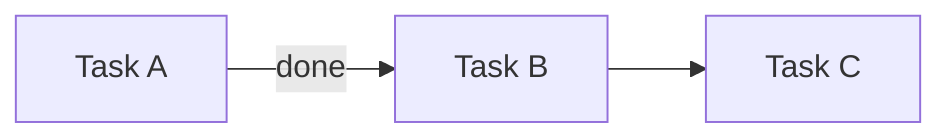

Maintain canonical per-initiative status in `.atomic-skills/` — read, create, update, display.

## Iron Law

NO IMPLEMENTATION WITHOUT ANCHORED INITIATIVE.

Every code-modifying session must be anchored to an active initiative in `.atomic-skills/initiatives/<slug>.md`, or the user must explicitly declare "ad-hoc".

## Initial detection

Run with {{BASH_TOOL}}:
- `test -d .atomic-skills/` — if absent, enter setup mode
- If present, read `.atomic-skills/PROJECT-STATUS.md` and determine active initiative

## Modes

See sections below per {{ARG_VAR}}.

## Setup (when `.atomic-skills/` does not exist)

Announce: "I will configure project-status in this repo."

### 1. Detect environment
- `test -d .claude/` → Claude Code
- `test -d .cursor/` → Cursor
- `test -d .gemini/` → Gemini CLI
- Otherwise → generic IDE; skip step 5

### 2. Verify/create CLAUDE.md
- If CLAUDE.md is absent: ask "Create minimal CLAUDE.md with hard-gate? (y/n)" — if yes, create with a title + hard-gate template
- If CLAUDE.md exists: prepare to inject block between markers

### 3. Inject hard-gate into CLAUDE.md (idempotent)
Read `skills/shared/project-status-assets/CLAUDE.md-gate.template.md` (assets packaged with the skill).
Check if markers `<!-- atomic-skills:status-gate:start -->` already exist:
- If yes and content is identical: skip
- If yes and content differs: show diff, ask if updating
- If not: append to end of CLAUDE.md

### 4. AGENTS.md redirect
- If AGENTS.md absent: create from `skills/shared/project-status-assets/AGENTS.md.template.md`
- If AGENTS.md exists and references CLAUDE.md: skip
- If AGENTS.md exists without reference: show suggested diff, ask confirmation (do not force)

### 5. Install hooks (Claude Code only)
Present Structured Options:
> What enforcement level?
> (a) Passive — hard-gate in CLAUDE.md only, no hooks
> (b) Soft (recommended) — hard-gate + SessionStart hook
> (c) Strict — hard-gate + SessionStart + Stop hook (dry-run 7d before real strict)

For (b) and (c): copy scripts to `.atomic-skills/status/hooks/`, register in `.claude/settings.local.json`.
For (c): copy `config.json` with `strict_mode: false` and `dry_run_started: $(date -I)`.

### 6. Create structure

Use {{BASH_TOOL}}:
```bash
mkdir -p .atomic-skills/initiatives/archive
mkdir -p .atomic-skills/status/hooks
```

Copy `PROJECT-STATUS.md.template.md` to `.atomic-skills/PROJECT-STATUS.md`, replacing `REPLACE_ISO_TIMESTAMP` with the current timestamp.

### 7. Update .gitignore
Append (if not present):
```
.atomic-skills/status/stop.log
.atomic-skills/status/SKIP
.atomic-skills/initiatives/*.rendered.md
```

### 8. Report
List everything created and give rollback instructions (`git status` + `git restore`).

## View modes

### Default (no args, structure exists)

If there is an active initiative whose `branch:` matches `git rev-parse --abbrev-ref HEAD`:
- Read `.atomic-skills/initiatives/<slug>.md`, parse frontmatter YAML
- Render in terminal:
  1. Header: `▸ <slug> · <status> · depth <N> · updated <human-timestamp>`
  2. STACK (tree with box-drawing): each frame from `stack:` indented; mark last with ` ◉ HERE`
  3. TASKS (table): ID | Title | State-with-icon | Updated
  4. PARKED + EMERGED side by side (2 columns)
  5. NEXT: `<next_action>` from frontmatter

Unicode icons:
- `✓` done, `◉` active, `·` pending, `⊘` blocked, `⌂` parked, `⇥` emerged
- `◉ HERE` marks the active frame
- `←` or `waits X` for dependencies

ANSI colors (respecting `$NO_COLOR`):
- done → green, active/HERE → cyan, pending/— → gray, blocked → yellow, parked → magenta

### `--list`

Table of all initiatives with `status: active`:

```
┌────────────────┬─────────┬─────────────┬──────────────┬────────────────────────┐
│ Slug           │ Status  │ Started     │ Branch       │ Next Action            │
├────────────────┼─────────┼─────────────┼──────────────┼────────────────────────┤
│ <slug>         │ active  │ YYYY-MM-DD  │ <branch>     │ <next_action>          │
└────────────────┴─────────┴─────────────┴──────────────┴────────────────────────┘
```

### `--stack`

Only the STACK section of the active initiative. 3-8 lines. For quick mid-session checks.

### `--archived`

Last 10 entries from `.atomic-skills/initiatives/archive/`, tabular.

## Parsing frontmatter YAML

You (LLM) can parse frontmatter YAML directly — it is plain text with predictable structure. For edge cases (nested quotes, multi-line, complex lists), consult the reference parser at `src/yaml.js` in the atomic-skills repo.

## Mutation modes

In each case, update `.atomic-skills/initiatives/<slug>.md` (frontmatter YAML) and bump `last_updated:` to now (`date -u +%Y-%m-%dT%H:%M:%SZ`).

### `new <slug>`

1. Validate slug: regex `^[a-z][a-z0-9-]{1,39}$`. Reject with a clear message if invalid.
2. Check for duplicate: if `.atomic-skills/initiatives/<slug>.md` exists, abort with a name suggestion.
3. Ask the user (if not obvious from context):
   - Initial title/description
   - Associated branch (auto-fills with `git branch --show-current` if none provided)
   - Path to plan doc (optional, stored in `plan_link:`)
4. Copy `skills/shared/project-status-assets/initiative.template.md` to `.atomic-skills/initiatives/<slug>.md`, replacing all `REPLACE_*` markers.
5. Append row to "Active Initiatives" table in `.atomic-skills/PROJECT-STATUS.md`.
6. Report to user with the created path.

### `push <description>`

1. Identify active initiative (via branch match or explicit `--slug` arg).
2. Read `stack:` from frontmatter.
3. Append new frame: `{id: <max_id+1>, title: "<description>", type: <inferred>, opened_at: <now>}`.
4. Save.
5. Announce: "Frame <N> pushed: <description>. Current depth: <N>."
6. If depth > `max_stack_depth_warning` (from config.json), warn: "Stack is deep — is this still the same initiative?"

Inferred types from verb: "research" → research; "test" → validation; "discuss" → discussion; otherwise → task.

### `pop [--resolve|--park|--emerge]`

0. If `stack:` is empty, abort with message: "Stack empty — nothing to pop."
1. Identify top frame of the stack.
2. Destination:
   - `--resolve` (default): remove from stack, add note in Done if it was a task
   - `--park`: move content to `parked:` (same initiative)
   - `--emerge`: move to `emerged:` (candidate for new initiative)
3. Remove frame from stack.
4. Announce: "Frame <N> popped to <destination>. Current frame: <new top>."
5. Update `last_updated` and save.

### `park <description>`

1. Identify active initiative.
2. Append to `parked:`: `{title: "<description>", surfaced_at: <now>, from_frame: <current-top-id>}`.
3. Save.

### `emerge <description>`

1. Identify active initiative.
2. Append to `emerged:`: `{title: "<description>", surfaced_at: <now>, promoted: false}`.
3. Save.
4. Offer: "Create new initiative now for '<description>'? (`new <slug>`)" — if yes, call `new` handler.

### `promote <parking-item-title-or-index>`

1. Locate item in `parked:`.
2. Generate next task ID (`T-<NNN+1>` based on the highest existing).
3. Add to `tasks:`: `<id>: {title: <parking title>, status: pending, last_updated: <now>}`.
4. Remove item from `parked:`.
5. Announce new task ID.

### `done <task-id>`

1. Locate task in `tasks:`.
2. Change `status: done`, add `closed_at: <now>`.
3. Save.
4. Announce.

### `archive [<slug>]`

1. Identify initiative (arg or active).
2. Change frontmatter `status: archived`.
3. Move file to `.atomic-skills/initiatives/archive/<YYYY-MM>-<slug>.md`.
4. Remove row from "Active Initiatives" in PROJECT-STATUS.md; append row to "Recently Archived" (keeping only last 10).
5. Announce.

### `switch <slug>`

1. Find target initiative. If it does not exist or status is not active/paused, abort.
2. Find currently active initiative — if one exists, change `status: paused`. If none is active (valid state: all paused), skip this step.
3. Change target to `status: active`.
4. Update PROJECT-STATUS.md index.
5. Announce.

## Disambiguation flow

Triggers when: current branch does not match any active initiative, OR multiple match, OR `disambiguate` is called explicitly.

Present Structured Options:

```
Detected context:
- Branch: <current-branch>
- No matching active initiative in .atomic-skills/PROJECT-STATUS.md

Active initiatives:
  1. <slug-1> (branch <branch-1>, last updated <timestamp>)
  2. <slug-2> (branch <branch-2>, <status>)

Is this work:
  (a) Continuation of an existing initiative (pick: 1 or 2)
  (b) Lateral expansion of an existing initiative (pick: 1 or 2; new frame added to its stack)
  (c) A new initiative (skill will prompt for name, goal)
  (d) Ad-hoc work (no initiative anchor)
```

By choice:
- (a): load selected file; ask where in the stack to resume
- (b): load file; `push` new frame for lateral expansion
- (c): call `new` handler
- (d): append row to "Ad-Hoc Sessions Log" in PROJECT-STATUS.md with timestamp + short description

## `--browser [<slug>]`

1. Determine slug (arg or active initiative).
2. **Ask confirmation** (intrusive-actions rule):
   > "Open initiative in browser? (y/N)"
   If no, abort.
3. Generate rendering at `.atomic-skills/initiatives/<slug>.rendered.md`:
   - Header with metadata
   - Mermaid Gantt of tasks (done/active/blocked)
   - Mermaid flowchart of dependencies (T-X → T-Y via blocker)
   - Stack as nested MD list
   - Tasks as MD table
   - Parked + Emerged as bullets
   - Narrative body from source file (passthrough)
4. Execute with {{BASH_TOOL}}:
   ```bash
   mdprobe .atomic-skills/initiatives/<slug>.rendered.md 2>/dev/null || npx -y @henryavila/mdprobe .atomic-skills/initiatives/<slug>.rendered.md
   ```
5. Report URL displayed by mdprobe.

Mermaid Gantt template:
```mermaid
gantt
    title <slug>
    dateFormat YYYY-MM-DD
    section Done
    <Task> :done, <start>, <end>
    section Active
    <Task> :active, <start>, <duration>
    section Blocked
    <Task> :crit, after <blocker>, <duration>
```

Mermaid Flowchart template:


(Substitute `T001/T002/T003` and titles with the real task IDs at render time.)

## `--report`

Emit MD to stdout, pasteable format for standups/PRs/updates:

```markdown
# Project Status — YYYY-MM-DD

## Active Initiatives

### <slug> (started YYYY-MM-DD)
**Next:** <next_action>
**Progress:** <N tasks done>; <M in progress> (stack depth <D>)
**Parked:** <list>
**Emerged:** <list>

### <slug-2> ...
```

No browser launch; pure stdout.

## Red Flags

If any of these thoughts appeared: STOP and validate.

- "I'll quickly edit this file without opening the initiative"
- "The current initiative probably matches, I don't need to check the branch"
- "Stack depth 7 is fine, it's still the same initiative"
- "This task is small, it doesn't need a task ID"
- "I'll pop the frame without deciding the destination; I'll sort it out later"
- "The Stop hook dry-run is showing too many false positives, I'll disable it without investigating"

## Rationalization

| Temptation | Reality |
|------------|---------|
| "Setup already ran before, no need to check again" | Re-checking is cheap (5s); silent drift is expensive |
| "CLAUDE.md already has something similar, no need for HARD-GATE" | Hard-gate is explicit and marked — it coexists without conflict |
| "Manual YAML parsing is fine, I don't need yaml.js" | Manual parsing breaks on edge cases (nested quotes, multi-line); use yaml.js for robustness |
| "I don't know if this change is lateral or a new initiative, I'll guess" | Use the disambiguation flow; 3 questions resolve it |
| "A stack with 8 frames means I'm overthinking" | Maybe — consider archive or split into a new initiative |
| "I can skip the confirmation before browser launch" | No — the intrusive-actions rule is firm |
