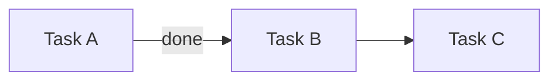

Mantenha o estado canônico de iniciativas em `.atomic-skills/` — ler, criar, atualizar e exibir.

## Regra Fundamental

NO IMPLEMENTATION WITHOUT ANCHORED INITIATIVE.

Todo código modificado deve ser ancorado a uma iniciativa ativa em `.atomic-skills/initiatives/<slug>.md`, ou o usuário deve declarar explicitamente "ad-hoc".

## Detecção inicial

Rode com {{BASH_TOOL}}:
- `test -d .atomic-skills/` — se não existe, entre em modo setup
- Se existe, leia `.atomic-skills/PROJECT-STATUS.md` e determine iniciativa ativa

## Modos

Ver seções abaixo conforme os args recebidos em {{ARG_VAR}}.

## Setup (quando `.atomic-skills/` não existe)

Anuncie: "Vou configurar project-status neste repo."

### 1. Detectar ambiente
- `test -d .claude/` → Claude Code
- `test -d .cursor/` → Cursor
- `test -d .gemini/` → Gemini CLI
- Caso contrário → IDE genérica; pule passo 5

### 2. Verificar/criar CLAUDE.md
- Se CLAUDE.md ausente: pergunte "Criar CLAUDE.md mínimo com hard-gate? (y/n)" — se sim, crie com um título + template hard-gate
- Se CLAUDE.md existe: prepare-se para injetar bloco entre markers

### 3. Injetar hard-gate em CLAUDE.md (idempotente)
Leia `skills/shared/project-status-assets/CLAUDE.md-gate.template.md` (assets empacotados com a skill).
Verifique se markers `<!-- atomic-skills:status-gate:start -->` já existem:
- Se sim e conteúdo idêntico: pule
- Se sim e conteúdo diferente: apresente diff, pergunte se atualiza
- Se não: append ao final de CLAUDE.md

### 4. AGENTS.md redirect
- Se AGENTS.md ausente: crie a partir de `skills/shared/project-status-assets/AGENTS.md.template.md`
- Se AGENTS.md existe e referencia CLAUDE.md: pule
- Se AGENTS.md existe sem referência: apresente diff sugerindo adição, peça confirmação (não force)

### 5. Instalar hooks (apenas Claude Code)
Apresente Structured Options:
> Qual nível de enforcement?
> (a) Passive — só hard-gate em CLAUDE.md, sem hooks
> (b) Soft (recomendado) — hard-gate + SessionStart hook
> (c) Strict — hard-gate + SessionStart + Stop hook (dry-run 7d antes de strict real)

Para (b) e (c): copie scripts para `.atomic-skills/status/hooks/`, registre em `.claude/settings.local.json`.
Para (c): copie `config.json` com `strict_mode: false` e `dry_run_started: $(date -I)`.

### 6. Criar estrutura

Use {{BASH_TOOL}}:
```bash
mkdir -p .atomic-skills/initiatives/archive
mkdir -p .atomic-skills/status/hooks
```

Copie `PROJECT-STATUS.md.template.md` para `.atomic-skills/PROJECT-STATUS.md`, substituindo `REPLACE_ISO_TIMESTAMP` pelo timestamp atual.

### 7. Atualizar .gitignore
Append (se não existente):
```
.atomic-skills/status/stop.log
.atomic-skills/status/SKIP
.atomic-skills/initiatives/*.rendered.md
```

### 8. Reportar
Liste tudo que foi criado e dê instruções de rollback (`git status` + `git restore`).

## Modos de exibição

### Default (sem args, estrutura existe)

Se há uma iniciativa ativa cuja `branch:` bate com `git rev-parse --abbrev-ref HEAD`:
- Leia `.atomic-skills/initiatives/<slug>.md`, parse frontmatter YAML
- Renderize no terminal:
  1. Header: `▸ <slug> · <status> · depth <N> · updated <timestamp-humano>`
  2. STACK (árvore com box-drawing): cada frame do `stack:` indentado; marque último com ` ◉ HERE`
  3. TASKS (tabela): ID | Title | State-com-ícone | Updated
  4. PARKED + EMERGED lado a lado (2 colunas)
  5. NEXT: `<next_action>` do frontmatter

Ícones Unicode:
- `✓` done, `◉` active, `·` pending, `⊘` blocked, `⌂` parked, `⇥` emerged
- `◉ HERE` marca frame ativo
- `←` ou `waits X` para dependências

Cores ANSI (respeitando `$NO_COLOR`):
- done → verde, active/HERE → ciano, pending/— → cinza, blocked → amarelo, parked → magenta

### `--list`

Tabela de todas iniciativas com `status: active`:

```
┌────────────────┬─────────┬─────────────┬──────────────┬────────────────────────┐
│ Slug           │ Status  │ Started     │ Branch       │ Next Action            │
├────────────────┼─────────┼─────────────┼──────────────┼────────────────────────┤
│ <slug>         │ active  │ YYYY-MM-DD  │ <branch>     │ <next_action>          │
└────────────────┴─────────┴─────────────┴──────────────┴────────────────────────┘
```

### `--stack`

Apenas a seção STACK da iniciativa ativa. 3-8 linhas. Para check rápido mid-session.

### `--archived`

Últimas 10 entradas de `.atomic-skills/initiatives/archive/`, tabular.

## Parsing YAML do frontmatter

Você (LLM) pode parsear o YAML do frontmatter diretamente — é texto simples, estrutura previsível. Para casos edge (aspas aninhadas, multi-line, listas complexas), consulte o parser de referência em `src/yaml.js` do repo atomic-skills.

## Modos de mutação

Em cada caso, atualize `.atomic-skills/initiatives/<slug>.md` (frontmatter YAML) e bump `last_updated:` para agora (`date -u +%Y-%m-%dT%H:%M:%SZ`).

### `new <slug>`

1. Valide slug: regex `^[a-z][a-z0-9-]{1,39}$`. Rejeite com mensagem clara se inválido.
2. Verifique duplicata: se `.atomic-skills/initiatives/<slug>.md` existe, aborte com sugestão de nome.
3. Pergunte ao usuário (se não for óbvio do contexto):
   - Título/descrição inicial
   - Branch associada (auto-preenche com `git branch --show-current` se nenhuma fornecida)
   - Caminho para plan doc (opcional, grava em `plan_link:`)
4. Copie `skills/shared/project-status-assets/initiative.template.md` para `.atomic-skills/initiatives/<slug>.md`, substituindo todos os `REPLACE_*` markers.
5. Append linha à tabela "Active Initiatives" em `.atomic-skills/PROJECT-STATUS.md`.
6. Reporte ao usuário com path criado.

### `push <descrição>`

1. Identifique iniciativa ativa (via branch match ou `--slug` explicit arg).
2. Leia `stack:` do frontmatter.
3. Append frame novo: `{id: <max_id+1>, title: "<descrição>", type: <inferido>, opened_at: <now>}`.
4. Salve.
5. Announce: "Frame <N> pushed: <descrição>. Current depth: <N>."
6. Se depth > `max_stack_depth_warning` (de config.json), alerte: "Stack profundo — ainda é a mesma iniciativa?"

Tipos inferidos do verbo: "research/pesquisar" → research; "test/testar" → validation; "discuss/discutir" → discussion; caso contrário → task.

### `pop [--resolve|--park|--emerge]`

0. Se `stack:` está vazio, aborte com mensagem: "Stack vazio — nada para popar."
1. Identifique top frame do stack.
2. Destino:
   - `--resolve` (default): remove do stack, adiciona nota em Done se era task
   - `--park`: move conteúdo para `parked:` (mesma iniciativa)
   - `--emerge`: move para `emerged:` (candidato a nova iniciativa)
3. Remova frame do stack.
4. Announce: "Frame <N> popped to <destino>. Current frame: <novo top>."
5. Atualize `last_updated` e salve.

### `park <descrição>`

1. Identifique iniciativa ativa.
2. Append a `parked:`: `{title: "<descrição>", surfaced_at: <now>, from_frame: <current-top-id>}`.
3. Salve.

### `emerge <descrição>`

1. Identifique iniciativa ativa.
2. Append a `emerged:`: `{title: "<descrição>", surfaced_at: <now>, promoted: false}`.
3. Salve.
4. Ofereça: "Criar nova iniciativa agora para '<descrição>'? (`new <slug>`)" — se sim, chame handler `new`.

### `promote <parking-item-title-or-index>`

1. Localize item em `parked:`.
2. Gere próximo task ID (`T-<NNN+1>` baseado no maior existente).
3. Adicione a `tasks:`: `<id>: {title: <título do parking>, status: pending, last_updated: <now>}`.
4. Remova item de `parked:`.
5. Announce novo task ID.

### `done <task-id>`

1. Localize task em `tasks:`.
2. Mude `status: done`, adicione `closed_at: <now>`.
3. Salve.
4. Announce.

### `archive [<slug>]`

1. Identifique iniciativa (arg ou ativa).
2. Mude frontmatter `status: archived`.
3. Mova arquivo para `.atomic-skills/initiatives/archive/<YYYY-MM>-<slug>.md`.
4. Remova linha de "Active Initiatives" em PROJECT-STATUS.md; append linha em "Recently Archived" (mantendo apenas últimas 10).
5. Announce.

### `switch <slug>`

1. Busque iniciativa alvo. Se não existe ou status não é active/paused, aborte.
2. Encontre iniciativa atualmente active — se existe, mude `status: paused`. Se nenhuma está active (estado válido: todas paused), pule esta etapa.
3. Mude alvo para `status: active`.
4. Atualize PROJECT-STATUS.md index.
5. Announce.

## Fluxo de Disambiguation

Dispara quando: branch atual não bate com nenhuma iniciativa ativa, OU múltiplas batem, OU `disambiguate` for chamado explicitamente.

Apresente Structured Options:

```
Detected context:
- Branch: <branch-atual>
- No matching active initiative in .atomic-skills/PROJECT-STATUS.md

Active initiatives:
  1. <slug-1> (branch <branch-1>, last updated <timestamp>)
  2. <slug-2> (branch <branch-2>, <status>)

Is this work:
  (a) Continuation of an existing initiative (pick: 1 or 2)
  (b) Lateral expansion of an existing initiative (pick: 1 or 2; new frame added to its stack)
  (c) A new initiative (skill will prompt for name, goal)
  (d) Ad-hoc work (no initiative anchor)
```

Por escolha:
- (a): carregue arquivo selecionado; pergunte onde no stack retomar
- (b): carregue arquivo; `push` novo frame para expansão lateral
- (c): chame handler `new`
- (d): append linha em "Ad-Hoc Sessions Log" de PROJECT-STATUS.md com timestamp + descrição curta

## `--browser [<slug>]`

1. Determine slug (arg ou iniciativa ativa).
2. **Pergunte confirmação** (regra de intrusive actions):
   > "Open initiative in browser? (y/N)"
   Se não, aborte.
3. Gere renderização em `.atomic-skills/initiatives/<slug>.rendered.md`:
   - Header com metadata
   - Mermaid Gantt das tasks (done/active/blocked)
   - Mermaid flowchart de dependências (T-X → T-Y via blocker)
   - Stack como lista MD aninhada
   - Tasks como tabela MD
   - Parked + Emerged como bullets
   - Corpo narrativo do source file (passthrough)
4. Execute com {{BASH_TOOL}} (fallback automático se mdprobe não instalado):
   ```bash
   mdprobe .atomic-skills/initiatives/<slug>.rendered.md 2>/dev/null || npx -y @henryavila/mdprobe .atomic-skills/initiatives/<slug>.rendered.md
   ```
5. Reporte URL exibida pelo mdprobe.

Template Mermaid Gantt:
```mermaid
gantt
    title <slug>
    dateFormat YYYY-MM-DD
    section Done
    <Task> :done, <start>, <end>
    section Active
    <Task> :active, <start>, <duration>
    section Blocked
    <Task> :crit, after <blocker>, <duration>
```

Template Mermaid Flowchart:


(Substitua `T001/T002/T003` e os títulos pelas task IDs reais ao renderizar.)

## `--report`

Emita MD no stdout, formato pasteable para standup/PR/update:

```markdown
# Project Status — YYYY-MM-DD

## Active Initiatives

### <slug> (started YYYY-MM-DD)
**Next:** <next_action>
**Progress:** <N tasks done>; <M in progress> (stack depth <D>)
**Parked:** <lista>
**Emerged:** <lista>

### <slug-2> ...
```

Sem browser launch; stdout puro.

## Red Flags

Se algum desses pensamentos apareceu: PARE e valide.

- "Vou editar esse arquivo rapidinho sem abrir o initiative"
- "A iniciativa atual provavelmente bate, não preciso checar branch"
- "O stack depth 7 tá OK, ainda é a mesma iniciativa"
- "Essa tarefa é pequena, não precisa de task ID"
- "Vou pop o frame sem decidir o destino; resolvo depois"
- "O hook Stop dry-run tá mostrando muitos false positives, vou desligar sem investigar"

## Racionalização

| Tentação | Realidade |
|----------|-----------|
| "Setup já rodou antes, não preciso checar" | Re-checar é barato (5s); drift silencioso é caro |
| "CLAUDE.md já tem algo parecido, não precisa HARD-GATE" | Hard-gate é explícito e markeado — coexiste sem conflito |
| "YAML parsing manual é OK, não preciso do yaml.js" | Manual parsing quebra em edge cases (aspas aninhadas, multi-line); use yaml.js para robustness |
| "Não sei se essa mudança é lateral ou nova iniciativa, vou chutar" | Use fluxo de disambiguation; 3 perguntas resolvem |
| "Stack com 8 frames é sinal que tô pensando demais" | Talvez sim — considere archive ou split em nova iniciativa |
| "Posso pular a confirmação antes do browser launch" | Não — regra de intrusive actions é firme |

## Bootstrap (import retroativo)

Quando `.atomic-skills/` acabou de ser criado via setup — ou a qualquer momento depois — o subcomando `bootstrap` varre o repo para descobrir iniciativas em voo e propor drafts revisáveis.

### Invocações

- `bootstrap` — pipeline completo (scan + cluster + synthesize); grava drafts em `.atomic-skills/bootstrap-drafts/`; abre INDEX.md no mdprobe (com confirmação)
- `bootstrap --dry-run` — mesmo scan, mas apenas resumo no terminal; nenhum arquivo escrito
- `bootstrap --commit` — materializa drafts aprovados em `.atomic-skills/initiatives/`; atualiza PROJECT-STATUS.md
- `bootstrap --scope=<list>` — limita fontes. Valores válidos (comma-separated): `git`, `github`, `docs`, `roadmap`, `memory-local`, `memory-claude`, `claude-mem`

### Oferta no setup

Ao final do passo 8 (Reportar) do setup, adicione:

> "Varrer repo pra descobrir iniciativas em andamento? (y/N)"

Se `y`, invoque `bootstrap` imediatamente na mesma sessão. Se `n` ou sem resposta: nenhuma ação — usuário pode rodar depois.

### Pré-condições

- `.atomic-skills/` deve existir (rode setup primeiro). Se não existir: aborte com `"rode setup primeiro"`.
- Para Camada 2 (Claude ecosystem): `.claude/` deve existir no repo.

### .gitignore

Ao criar `.atomic-skills/` (passo 6 do setup), adicione também:

```
.atomic-skills/bootstrap-drafts/
.atomic-skills/status/bootstrap.json
```

### Fase 1a — Shell enumerate

Coleta determinística. Nenhuma interpretação de conteúdo.

#### Git (sempre)

```bash
# Branches ativas (últimos 180d)
git for-each-ref --sort=-committerdate \
  --format='%(refname:short)|%(committerdate:iso-strict)|%(authorname)' \
  refs/heads refs/remotes/origin

# Commits recentes agrupados por escopo Conventional Commits (90d)
git log --since='90 days ago' --pretty=format:'%h|%s|%ci' \
  | grep -E '^[a-f0-9]+\|(feat|fix|refactor|docs|test|chore)\([^)]+\):'
```

#### GitHub CLI (se `gh` disponível)

```bash
gh pr list --state open --json number,title,headRefName,updatedAt,body,labels 2>/dev/null
gh pr list --state merged --limit 20 --json number,title,headRefName,mergedAt 2>/dev/null
gh issue list --state open --assignee @me --json number,title,labels,updatedAt 2>/dev/null
```

Se falhar: logue `source: github skipped (gh unavailable)` e continue. Não fatal.

#### Docs estruturados (sempre)

```bash
find docs/superpowers/plans -type f -name '*.md' 2>/dev/null
find docs/superpowers/specs -type f -name '*.md' 2>/dev/null
find docs -type d -name 'adr*' -exec find {} -name '*.md' \; 2>/dev/null
```

#### Roadmap (sempre)

```bash
for f in TODO.md ROADMAP.md NEXT.md docs/TODO.md docs/ROADMAP.md; do
  test -f "$f" && echo "$f"
done
```

Para cada arquivo encontrado, parseie H2/H3 headers com spans de linhas (shell lê os headers; LLM lê as seções em 1b).

#### Memory local (sempre)

```bash
test -f .ai/memory/MEMORY.md && echo ".ai/memory/MEMORY.md"
find .ai/memory -maxdepth 2 -name '*.md' -not -name 'MEMORY.md' 2>/dev/null
```

Parseie MEMORY.md como índice (formato `[Title](file.md) — hook`).

#### Claude ecosystem (Camada 2 — só se `.claude/` existe)

```bash
REPO_PATH=$(pwd | sed 's|^/|-|; s|/|-|g')
CLAUDE_PROJ_DIR="$HOME/.claude/projects/$REPO_PATH"
test -d "$CLAUDE_PROJ_DIR/memory" && \
  find "$CLAUDE_PROJ_DIR/memory" -maxdepth 1 -name '*.md' -not -name 'MEMORY.md'
```

claude-mem obs: use MCP tool `mcp__plugin_claude-mem_mcp-search__search` (deferred) com filtro do projeto.

Output de 1a: lista de `sources` com `type`, `id`, `last_activity`, `raw`. Nenhuma leitura de conteúdo ainda.

### Fase 1b — LLM extract

Aplicada apenas a sources narrativos (`doc-plan`, `doc-spec`, `doc-adr`, `roadmap-section`, `memory-local-entry`, `memory-local-orphan`, `memory-claude-auto`, `claude-mem-obs`).

Sources estruturais (`git-branch`, `github-pr-*`, `github-issue-*`, `commit-group`) pulam 1b.

Para cada source narrativo, leia o conteúdo e emita zero ou mais signal objects:

```yaml
signal:
  source_id: <de 1a>
  source_type: <de 1a>
  topic_hint: <kebab-case slug curto>
  evidence_quote: <1-2 frases verbatim>
  candidate_completion: active | paused | done | unknown
  referenced_identifiers: [<branches, paths, slugs mencionados>]
  surfaced_subtopics: [<slugs laterais>]
```

Instrução interna (aplicada por você, LLM):

> "Leia esta fonte. Para cada tópico distinto que pareça trabalho pendente ou em voo (não documentação geral, não retrospectiva de trabalho completo, não conteúdo puramente de aprendizado), emita signal com:
> - topic_hint: slug kebab-case curto
> - evidence_quote: 1-2 frases verbatim
> - candidate_completion: active | paused | done | unknown
> - identificadores referenciados (branches, paths, slugs)
> - surfaced_subtopics: slugs laterais mencionados
>
> Pule: documentação geral, decisões sem ação forward, trabalho completo, learnings puros, style guides, API reference."

Um source pode gerar múltiplos signals. Cada um herda `last_activity` do source (ou override se o texto cita "rediscutido em YYYY-MM-DD").
